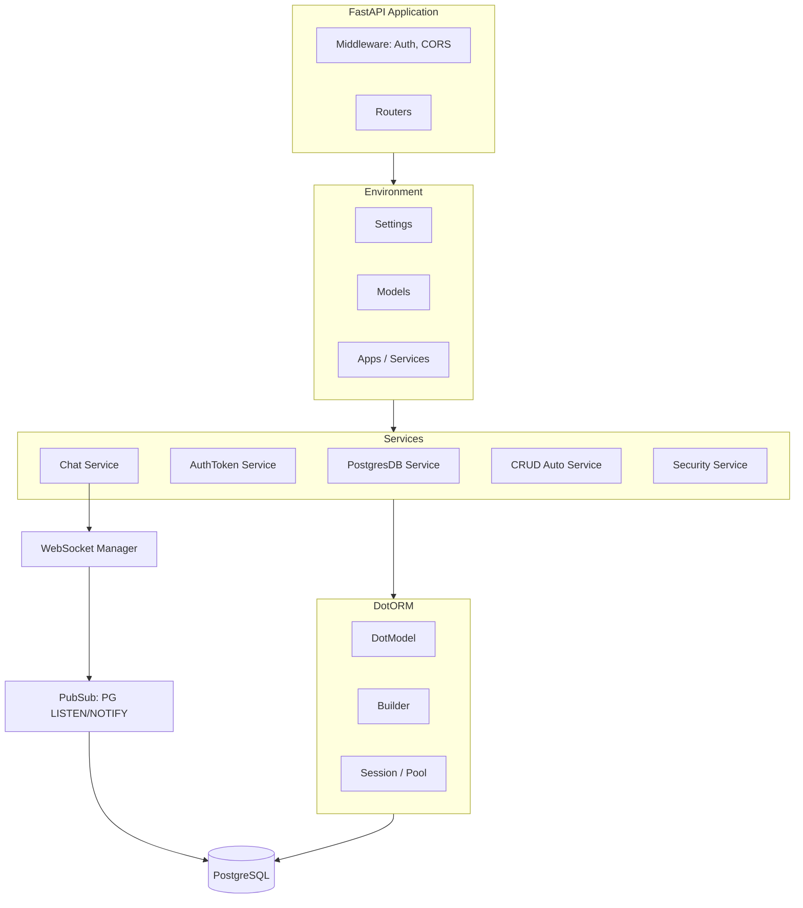
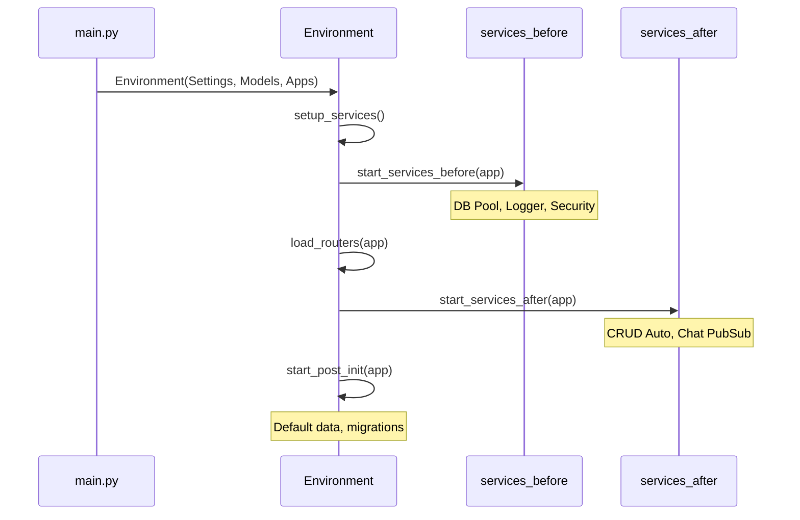
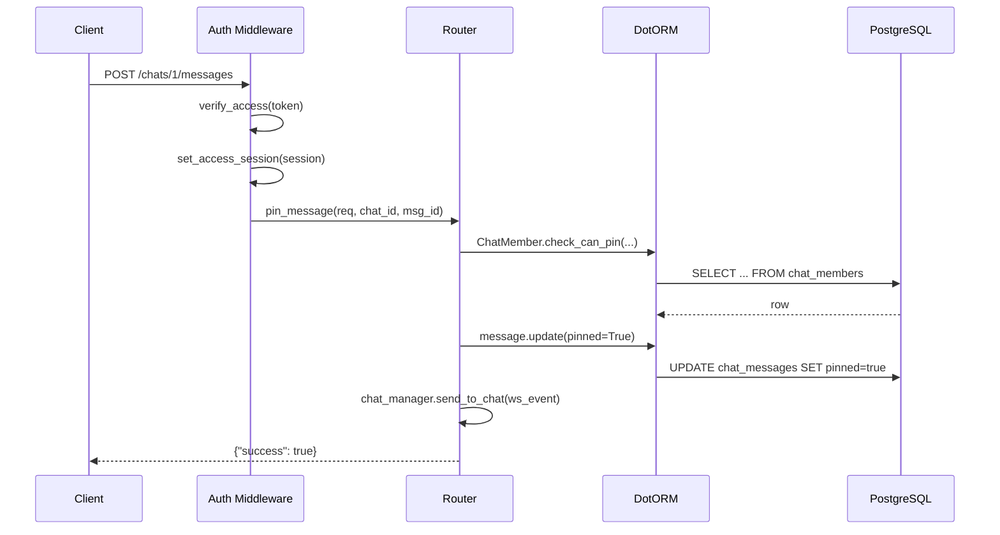

# Архитектура Backend

## Обзор



## Жизненный цикл приложения

Приложение запускается в определённом порядке — это критично для корректной инициализации:



### Порядок запуска сервисов

```python title="backend/project_setup.py"
class Apps(AppsCore):
    """Определяет порядок инициализации модулей."""

    services_before = [
        "logger",                     # 1. Логирование
        "dotorm_databases_postgres",   # 2. DB Pool
        "security",                    # 3. ACL, роли
        "auth_token",                  # 4. Аутентификация
    ]

    services_after = [
        "dotorm_crud_auto",           # 5. CRUD роутеры
        "chat",                       # 6. WebSocket + PubSub
    ]
```

!!! warning "Порядок важен"
    `services_before` запускаются **до** загрузки роутеров — они настраивают DB pool, без которого роутеры не могут работать. `services_after` запускаются **после** — они могут использовать роутеры и другие сервисы.

## Модульная структура

Каждый CRM-модуль — это папка с фиксированной структурой:

```
backend/base/crm/chat/
├── app.py              # Service: startup/shutdown
├── models/             # DotModel-классы
│   ├── chat.py
│   ├── chat_message.py
│   └── chat_member.py
├── routers/            # FastAPI роутеры
│   ├── chats.py
│   └── messages.py
├── schemas/            # Pydantic-схемы (если нужны)
└── websocket/          # Доп. логика (WS, pubsub)
```

Регистрация модуля в `project_setup.py`:

```python title="backend/project_setup.py"
class Models(ModelsCore):
    # Каждая модель получает CRUD API автоматически
    chat = Chat
    chat_message = ChatMessage
    chat_member = ChatMember
    user = User
    # ...
```

## Request Lifecycle


