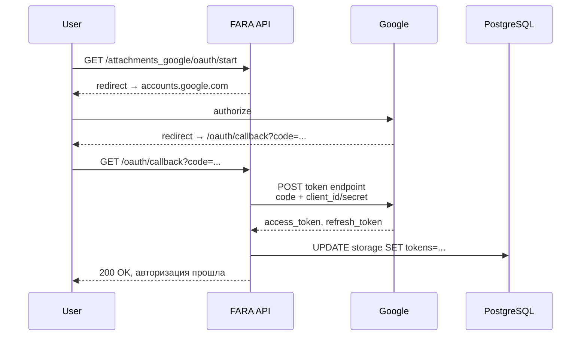

# Google Drive

`GoogleDriveStrategy` — провайдер для Google Drive. OAuth2 авторизация через сервисный аккаунт компании, поддержка Shared Drives, real-time синхронизация и cron-режимы.

## Когда выбирать

- Команда уже использует Google Workspace.
- Нужно делиться файлами с внешними партнёрами через ссылки Google.
- Хочется bulk-просмотр в нативном UI Drive.
- Нет ограничений по объёму (Workspace платный).

Минусы по сравнению с локальным:

- OAuth-токен может протухать — нужно следить.
- Latency на каждую операцию (300-800ms).
- Ограничения на количество запросов в Google API.

## Авторизация — OAuth2

Стратегия сохраняет в `AttachmentStorage` четыре поля:

<div class="field" markdown>
`google_client_id` <span class="field-type">Char</span>

OAuth2 client ID из Google Cloud Console.
</div>

<div class="field" markdown>
`google_client_secret` <span class="field-type">Char</span>

OAuth2 client secret. Хранится зашифрованным.
</div>

<div class="field" markdown>
`google_access_token` <span class="field-type">Text</span>

Текущий access token. Действует ~1 час.
</div>

<div class="field" markdown>
`google_refresh_token` <span class="field-type">Text</span>

Refresh token. Не протухает (до отзыва пользователем). Используется для автообновления access token.
</div>

### Scopes

Стратегия запрашивает два scope:

```python
SCOPES = [
    "https://www.googleapis.com/auth/drive",       # полный доступ
    "https://www.googleapis.com/auth/drive.file",  # доступ к файлам приложения
]
```

Первый шире — нужен для работы с Shared Drives и поиска папок по имени.

### Поток OAuth



### Автообновление токена

Перед каждой операцией стратегия вызывает `get_credentials()`. Если access_token истекает в ближайшие 5 минут — автоматически обновляется через refresh_token. Новый сохраняется в `AttachmentStorage`.

```python
async def get_credentials(self, storage):
    creds = Credentials(
        token=storage.google_access_token,
        refresh_token=storage.google_refresh_token,
        ...
    )

    needs_refresh = (
        creds.expiry and creds.expiry - datetime.utcnow() < timedelta(minutes=5)
    )
    if needs_refresh and creds.refresh_token:
        creds.refresh(Request())
        await storage.update(AttachmentStorage(
            google_access_token=creds.token,
            ...
        ))
    return creds
```

## Shared Drives

Если файлы должны лежать в общем диске компании (а не на личном My Drive), включаются Shared Drives:

<div class="field" markdown>
`google_team_enabled` <span class="field-type">bool</span>

Использовать ли Shared Drive вместо личного Drive.
</div>

<div class="field" markdown>
`google_team_id` <span class="field-type">Char</span>

ID Shared Drive (из URL: `drive.google.com/drive/folders/{ID}`).
</div>

При включённом флаге к каждому API-запросу добавляются параметры:

```python
{
    "supportsAllDrives": True,
    "driveId": storage.google_team_id,
    "corpora": "drive",
    "includeItemsFromAllDrives": True,
}
```

Это критично — без них API будет искать файлы только в My Drive сервисного аккаунта.

## Структура папок

При первой загрузке файла к записи стратегия:

1. Смотрит подходящий `AttachmentRoute` для `res_model`.
2. Применяет `pattern_root` → создаёт корневую папку модели (`Sales Orders/`).
3. Применяет `pattern_record` → создаёт папку записи (`SO-0000042-ClientA/`).
4. Загружает файл туда.
5. Сохраняет `parent_id` в `AttachmentCache`, чтобы следующие файлы той же записи легли в эту же папку без повторного поиска.

```mermaid
graph TB
    R[Route<br/>model=sale<br/>pattern_root=Sales Orders<br/>pattern_record=SO-0000{id}-{name}] --> RootCheck{Папка<br/>Sales Orders/<br/>есть?}
    RootCheck -->|нет| CreateRoot[Создать]
    RootCheck -->|да| RootId
    CreateRoot --> RootId[parent_id=A]
    RootId --> RecCheck{Папка<br/>SO-0000042-ClientA/<br/>есть?}
    RecCheck -->|нет| CreateRec[Создать]
    RecCheck -->|да| RecId
    CreateRec --> RecId[parent_id=B]
    RecId --> Cache[Сохранить в Cache:<br/>storage,sale,42 → B]
    Cache --> Upload[Upload file → parent_id=B]
```

## Real-time vs cron

- **Real-time** (`enable_realtime=true`): каждая загрузка через FARA сразу льётся в Google. Латентность операции = 0.5-2 сек на типичный файл, видна пользователю.
- **One-way cron**: файл сначала пишется локально через FileStore, в облако улетает в фоне. Пользователь видит мгновенный успех, ошибки облака не блокируют сохранение.
- **Two-way cron**: дополнительно тянет вниз файлы, которые менеджер положил в Drive вручную (минуя FARA).
- **Routes cron**: при переименовании записей (например, поле `name` лида) переименовывает соответствующие папки в Drive.

## Размещение файлов в обход Route

Если `res_model` без специального Route — используется fallback Route (`model=NULL`, `priority=0`). Имя корневой папки по умолчанию `{model}` (то есть просто имя таблицы).

## Что использует библиотека

Внутри стратегии — `googleapiclient.discovery.build("drive", "v3", credentials=...)`. Все вызовы оборачиваются в `asyncio.to_thread(...)`, потому что googleapiclient синхронный.

```python
async def _drive_call(self, drive, fn, *args, **kwargs):
    return await asyncio.to_thread(fn, *args, **kwargs)
```

## Ограничения Google API

- **Лимит запросов**: 1000 запросов/100 сек на пользователя. На массовых импортах легко упереться. Стратегия делает paced uploads.
- **Размер файла через resumable upload**: 5 ТБ. Через простой upload — 5 МБ. Стратегия использует `MediaFileUpload(resumable=True)` всегда.
- **Расширение в имени файла**: Google Drive отделяет MIME-тип от имени. FARA пишет MIME явно, имя берётся из `Attachment.name`.

## Известные нюансы

!!! warning "Один аккаунт — один storage"
    Если хочется иметь два разных Google аккаунта (например, разделить личные и корпоративные файлы) — заводится **два** `AttachmentStorage` с разными OAuth, и активным может быть только один. Переключение через `set_active()`.

!!! info "Файлы, удалённые в Drive вручную"
    Если включён `file_missing_cloud=cloud` — при следующей попытке прочитать файл (которого уже нет в Drive) запись `Attachment` тоже удалится. Если `nothing` — запись останется, скачивание вернёт 404.
