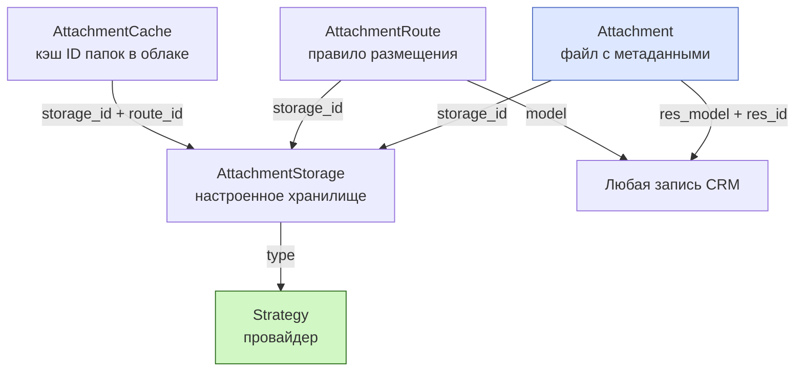
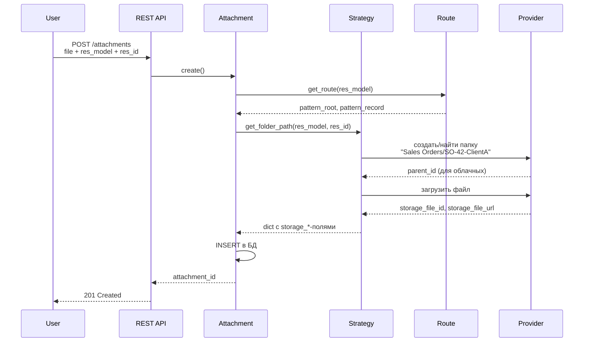

# Вложения — обзор

Модуль `attachments` управляет файлами всей FARA. Поддерживает несколько провайдеров хранения (локальный диск, Google Drive, Яндекс.Диск) через паттерн Strategy. Активным может быть только одно хранилище — оно принимает новые файлы.

## Архитектура

Четыре связанные сущности:



| Класс | Что хранит | Пример |
|-------|------------|--------|
| `Attachment` | Файл + полиморфная привязка | `name="contract.pdf", res_model="sale", res_id=42` |
| `AttachmentStorage` | Настройка провайдера | «Google Drive офиса» — type=google, active=true |
| `AttachmentRoute` | Шаблон папок | «sale → Sales Orders/SO-{id}-{name}» |
| `AttachmentCache` | ID облачных папок | «storage=2 + sale#42 → folder_id=abc123» |
| `Strategy` | Логика работы с провайдером | `FileStoreStrategy`, `GoogleDriveStrategy`, `YandexDiskStrategy` |

## Паттерн Strategy

`StorageStrategyBase` (в `attachments/strategies/strategy.py`) — базовый класс. Каждый провайдер реализует свой подкласс:

```python
class StorageStrategyBase(ABC):
    strategy_type: str = ""

    @abstractmethod
    async def create_file(self, storage, attachment, content, filename, ...): ...

    @abstractmethod
    async def read_file(self, storage, attachment) -> bytes | None: ...

    @abstractmethod
    async def update_file(self, storage, attachment, content=None, ...): ...

    @abstractmethod
    async def delete_file(self, storage, attachment) -> bool: ...

    # Опциональные — для облачных хранилищ
    async def create_folder(self, storage, folder_name, parent_id=None): ...
    async def get_folder_path(self, storage, res_model, res_id): ...
    async def get_credentials(self, storage): ...
    async def validate_connection(self, storage) -> bool: ...
```

Регистрация:

```python
from backend.base.crm.attachments.strategies import register_strategy

class GoogleDriveStrategy(StorageStrategyBase):
    strategy_type = "google"
    ...

register_strategy(GoogleDriveStrategy)
```

После регистрации `AttachmentStorage(type="google")` будет работать через эту стратегию автоматически.

## Полиморфная привязка

Как и `Activity`, `Attachment` привязывается к любой записи через `res_model` + `res_id`:

```python
# Прикрепить файл к лиду
await Attachment.create_file(
    res_model="lead",
    res_id=lead.id,
    name="Договор.pdf",
    content=file_bytes,
    mimetype="application/pdf",
)

# Получить все файлы лида
attachments = await Attachment.search(
    filter=[("res_model", "=", "lead"), ("res_id", "=", lead.id)],
)
```

Это дешевле, чем заводить FK на каждую таблицу. Минус — нет cascade при удалении (см. ниже).

## Жизненный цикл файла



## Active storage

В системе одновременно может быть **только одно активное хранилище** (`active=true`). Все новые файлы идут туда. Остальные хранилища при этом могут существовать (для миграций, бэкапа), но новые загрузки в них не идут.

```python
# Получить активное
storage = await AttachmentStorage.get_active_storage()

# Сделать активным (предыдущее автоматически деактивируется)
await new_storage.update(AttachmentStorage(active=True))
```

## Routes — структура папок

Для облачных хранилищ важно, чтобы файлы лежали по логичным папкам, а не сваливались в кучу. `AttachmentRoute` решает это через шаблоны:

| Поле | Пример | Что делает |
|------|--------|-----------|
| `model` | `"sale"` | Для какой модели маршрут (NULL = fallback) |
| `priority` | `10` | Чем выше — тем раньше проверяется |
| `pattern_root` | `"Sales Orders"` | Имя корневой папки модели |
| `pattern_record` | `"SO-{zfill(id)}-{name}"` | Имя папки записи |

Результат:

```
Google Drive/
└── Sales Orders/                    ← pattern_root
    ├── SO-0000042-ClientA/          ← pattern_record для record_id=42
    │   ├── contract.pdf
    │   └── invoice.pdf
    └── SO-0000043-ClientB/
        └── proposal.docx
```

Доступные подстановки:

- `{id}` — id записи
- `{zfill(id)}` — id с лидирующими нулями
- `{name}` — поле `name` записи
- `{model}` / `{table}` — имя модели

## Cache — оптимизация

`AttachmentCache` хранит, в какой папке облака лежит запись:

```
storage_id=2, route_id=5, res_model='sale', res_id=42 → folder_id="abc123"
```

Это нужно, чтобы при загрузке второго/третьего файла к той же записи не искать папку заново через API облака. Кэш живёт пока существует папка.

## Sync-режимы

`AttachmentStorage` поддерживает несколько режимов синхронизации:

| Режим | Поле | Что делает |
|-------|------|-----------|
| **Real-time** | `enable_realtime` | Каждая загрузка сразу льёт в облако (синхронно) |
| **One-way cron** | `enable_one_way_cron` | Cron периодически перекладывает локальные файлы в облако |
| **Two-way cron** | `enable_two_way_cron` | Кроме закачки наверх, тянет вниз файлы, появившиеся в облаке (например, юзер положил вручную) |
| **Routes cron** | `enable_routes_cron` | Синхронизация структуры папок (имена, переименования) |

Если real-time не включён — файлы пишутся в локальный fallback (`AttachmentStorage(type="file")`), а в облако улетают по cron.

## Действия при пропаже файла

`file_missing_cloud` — что делать, если файл, ожидаемый в облаке, отсутствует:

- `nothing` — оставить запись `Attachment` как есть (можно перезалить).
- `cloud` — удалить запись из FARA (раз в облаке нет, считаем что нет вообще).

## Что дальше

- [Локальное хранилище](filestore.md) — `FileStoreStrategy`, простая запись на диск
- [Google Drive](google.md) — OAuth, Shared Drives, особенности API
- [Яндекс.Диск](yandex.md) — REST API, нюанс с redirects
