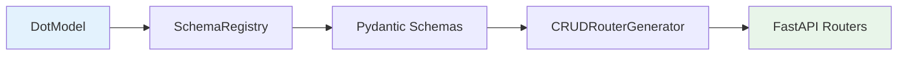

# CRUD Auto — автогенерация REST API

Каждая зарегистрированная модель автоматически получает полный набор REST-эндпоинтов. Ноль строк кода — только определение модели.

## Генерируемые эндпоинты

Для модели с `__route__ = "products"`:

| Метод | URL | Описание |
|-------|-----|----------|
| <span class="method-post">POST</span> | `/products/search` | Поиск с фильтрами и пагинацией |
| <span class="method-post">POST</span> | `/products/create` | Создание записи |
| <span class="method-get">GET</span> | `/products/read/{id}` | Чтение записи по ID |
| <span class="method-patch">PATCH</span> | `/products/update/{id}` | Обновление записи |
| <span class="method-delete">DELETE</span> | `/products/delete` | Удаление записей |
| <span class="method-get">GET</span> | `/products/read_default_values` | Значения по умолчанию |

## Как это работает



1. **SchemaRegistry** анализирует все поля модели
2. Генерирует **Pydantic-схемы** для валидации (create, update, read, search)
3. **CRUDRouterGenerator** создаёт FastAPI-роутеры с этими схемами
4. Роутеры подключаются к приложению при старте

## Search API

```http
POST /products/search
Content-Type: application/json

{
    "filter": [
        ["active", "=", true],
        ["price", ">", 100]
    ],
    "fields": ["id", "name", "price", "category_id"],
    "order": "price",
    "sort": "desc",
    "start": 0,
    "end": 20,
    "limit": 20
}
```

**Ответ:**

```json
{
    "data": [
        {"id": 5, "name": "Widget Pro", "price": 299, "category_id": 2},
        {"id": 3, "name": "Widget Basic", "price": 199, "category_id": 1}
    ],
    "total": 42
}
```

## Create API

```http
POST /products/create
Content-Type: application/json

{
    "name": "New Product",
    "price": 199.99,
    "category_id": 1,
    "active": true
}
```

**Ответ:**

```json
{
    "data": {"id": 43}
}
```

## Read API

```http
GET /products/read/43?fields=id,name,price,category_id
```

**Ответ:**

```json
{
    "data": {
        "id": 43,
        "name": "New Product",
        "price": 199.99,
        "category_id": {"id": 1, "name": "Electronics"}
    }
}
```

## Update API

```http
PATCH /products/update/43
Content-Type: application/json

{
    "price": 249.99,
    "name": "Updated Product"
}
```

## Кастомные роутеры

Для модулей, которым нужна дополнительная логика, создавай обычные FastAPI-роутеры:

```python title="backend/base/crm/chat/routers/messages.py"
from fastapi import APIRouter, Request

router_private = APIRouter(
    prefix="/chats",
    tags=["Chat Messages"],
)

@router_private.post("/{chat_id}/messages")
async def send_message(req: Request, chat_id: int, body: MessageCreate):
    """Кастомный эндпоинт с бизнес-логикой."""
    env = req.app.state.env

    # Проверка прав
    await ChatMember.check_can_write(chat_id, user_id)

    # Создание через ORM
    msg_id = await env.models.chat_message.create(
        env.models.chat_message(
            chat_id=chat_id,
            author_user_id=user_id,
            body=body.body,
        )
    )

    # WebSocket уведомление
    await chat_manager.send_to_chat(chat_id, {...})

    return {"data": {"id": msg_id}}
```

!!! tip "CRUD Auto + кастомные роутеры"
    Модель может одновременно иметь авто-CRUD роуты и кастомные роутеры. Авто-CRUD покрывает базовые операции, а кастомные — бизнес-логику (чат, транзакции, уведомления).
