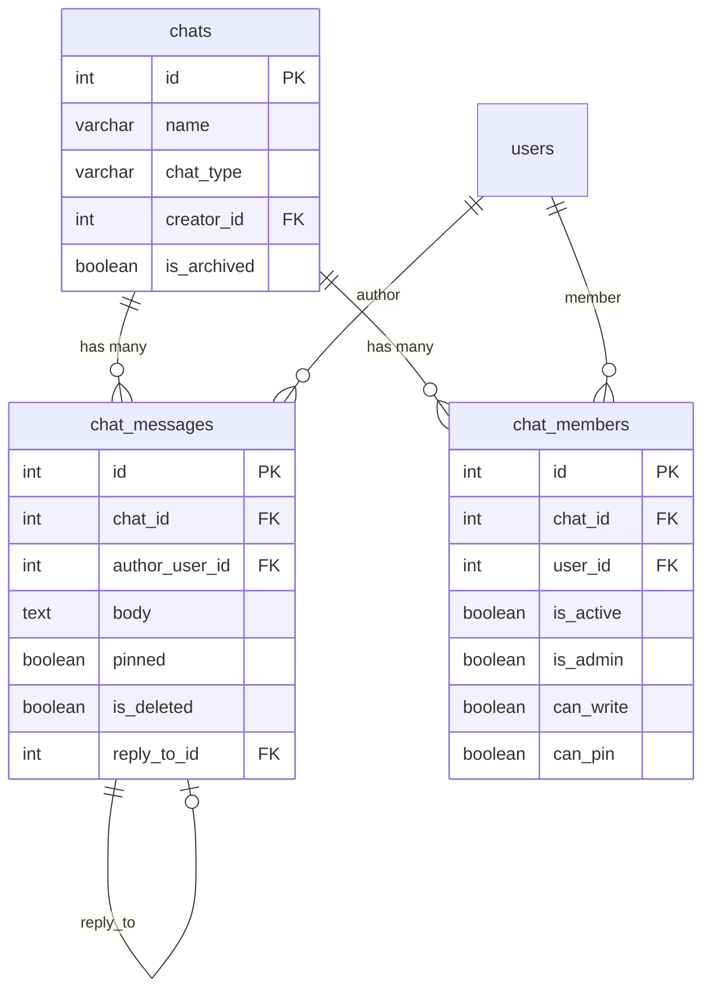

# Связи (Relations)

## Чтение связей

### Many2one — вложенные данные

По умолчанию FK-поля возвращают только ID. Для получения вложенных данных используй `fields_nested`:

```python
# Только ID автора
msg = await ChatMessage.get(1, fields=["id", "body", "author_user_id"])
msg.author_user_id  # 42 (int)

# С вложенными данными автора
msg = await ChatMessage.get(
    1,
    fields=["id", "body", "author_user_id"],
    fields_nested={
        "author_user_id": ["id", "name", "login"],  # (1)!
    },
)
msg.author_user_id.id    # 42
msg.author_user_id.name  # "John"
```

1. Ключ — имя FK-поля, значение — список полей из связанной таблицы.

### One2many — дочерние записи

```python
chat = await Chat.get(
    1,
    fields=["id", "name", "messages"],
    fields_nested={
        "messages": ["id", "body", "author_user_id"],
    },
)

for msg in chat.messages:
    print(f"{msg.author_user_id}: {msg.body}")
```

### Many2many

```python
user = await User.get(
    1,
    fields=["id", "name", "role_ids"],
    fields_nested={
        "role_ids": ["id", "name"],
    },
)

for role in user.role_ids:
    print(role.name)  # "admin", "manager", ...
```

## Запись связей

### Many2one — установка FK

```python
# При создании
msg_id = await ChatMessage.create(
    ChatMessage(chat_id=1, author_user_id=42, body="Hello")
)

# При обновлении
await msg.update(ChatMessage(author_user_id=99))
```

### One2many / Many2many — команды

Для обновления One2many и Many2many используются **команды**:

```python
await user.update(User(
    role_ids={
        "selected": [1, 2, 3],       # установить связи (заменить)
        "created": [                   # создать новые записи
            {"name": "New Role"},
        ],
        "deleted": [4, 5],            # удалить связи
    }
))
```

| Команда | Описание |
|---------|----------|
| `selected` | Установить связи с существующими записями |
| `unselected` | Убрать связи (без удаления записей) |
| `created` | Создать новые записи и установить связи |
| `deleted` | Удалить записи по ID |

```python
# Пример: добавить участника в чат
await chat.update(Chat(
    members={
        "created": [
            {
                "user_id": new_user_id,
                "is_active": True,
                "can_read": True,
                "can_write": True,
            }
        ],
    }
))

# Пример: удалить участника из чата
await chat.update(Chat(
    members={
        "deleted": [member_id],
    }
))
```

## Диаграмма связей (Chat модуль)


