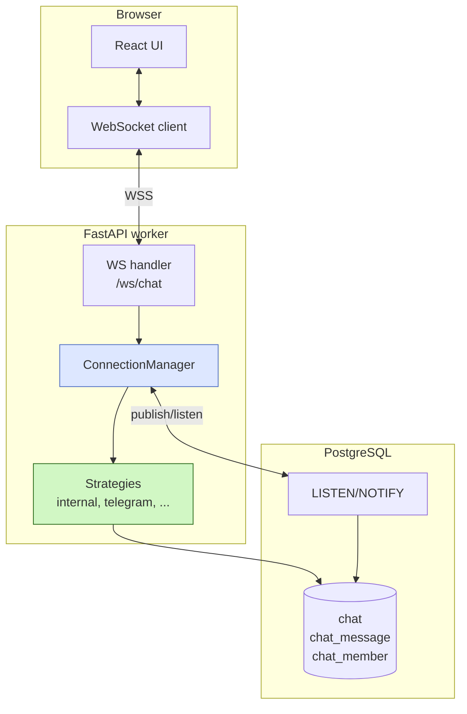
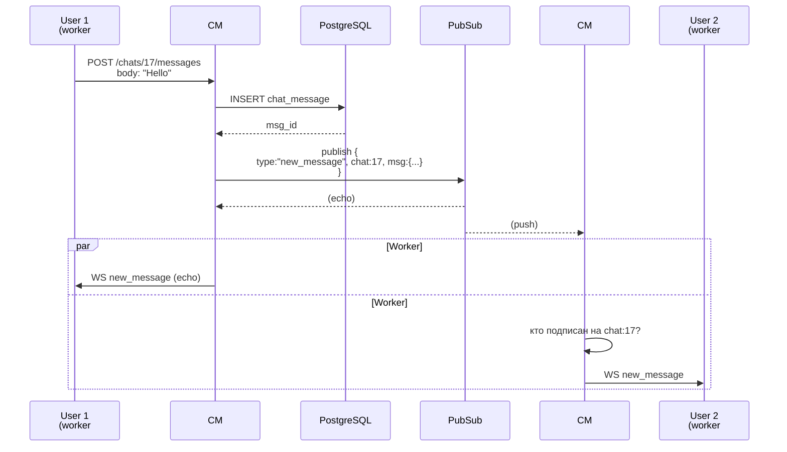
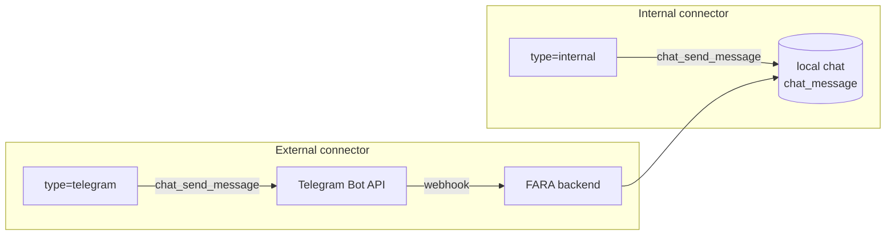

# Архитектура чата

Эта страница — про устройство модуля чата изнутри. Базовый API (endpoints, типы чатов, права) описан в [Chat Module](chat.md). Здесь — внутренние механизмы: WebSocket, PubSub, коннекторы, presence.

## Слои



## ConnectionManager

`ChatConnectionManager` (в `chat/websocket/manager.py`) — центральный объект чата на каждом воркере. Его задачи:

1. **Локальные подключения** — словарь `dict[user_id, set[WebSocket]]`. Один пользователь может иметь несколько вкладок.
2. **Подписки на чаты** — `dict[user_id, set[chat_id]]`. По какому чату пушить сообщения юзеру.
3. **Presence** — кто сейчас онлайн.
4. **Pending invites** — для звонков (см. [Звонки](calls.md)).
5. **Pub/Sub bridge** — отправляет события в кросс-процессный канал и слушает входящие.

```python
class ChatConnectionManager:
    def __init__(self):
        self._connections: dict[int, set[WebSocket]] = {}
        self._user_subscriptions: dict[int, set[int]] = {}
        self._pubsub: PubSubBackend = create_pubsub_backend(...)

    async def send_to_user(self, user_id: int, message: dict): ...
    async def send_to_chat(self, chat_id: int, message: dict): ...
    async def subscribe_to_chats(self, user_id: int, chat_ids: list[int]): ...
```

## Cross-process через PubSub

FastAPI обычно запускается в нескольких воркерах (uvicorn `--workers 4`). Если юзер А подключился к воркеру #1, а юзер Б — к воркеру #3, обычные in-memory структуры не помогут им найти друг друга.

Решение — pub/sub-канал с двумя реализациями:

=== "PostgreSQL (default)"

    ```bash title=".env"
    PUBSUB__BACKEND=pg
    ```

    Использует `LISTEN/NOTIFY`. Один поток на каждом воркере держит отдельный коннект к Postgres и подписывается на канал `chat_pubsub`. Каждое сообщение `send_to_user/send_to_chat` уходит сначала в `pg_notify('chat_pubsub', json)`, и все воркеры (включая отправителя) получают это в LISTEN-callback.

    **Плюсы**: ничего не нужно ставить дополнительно — PG уже есть.
    **Минусы**: занимает 1 коннект на воркер из пула; при очень высокой нагрузке (>1000 событий/сек) может стать узким местом.

=== "Redis"

    ```bash title=".env"
    PUBSUB__BACKEND=redis
    PUBSUB__REDIS_URL=redis://localhost:6379/0
    ```

    Стандартный Redis Pub/Sub. Подписка через `PSUBSCRIBE chat:*`.

    **Плюсы**: высокий throughput, не задействует PG-коннекты.
    **Минусы**: дополнительная инфраструктура.

```python title="Strategy Pattern"
# pubsub/
# ├── __init__.py      # create_pubsub_backend() factory
# ├── base.py          # PubSubBackend (abstract)
# ├── pg_backend.py    # PostgreSQL LISTEN/NOTIFY
# └── redis_backend.py # Redis Pub/Sub
```

Переключение бэкенда — только переменная окружения, код модуля чата не меняется.

## Жизненный цикл сообщения



Эхо отправителю нужно для multi-tab: если у юзера открыто две вкладки, на второй сообщение тоже появится сразу.

## Presence

При connect:

1. Юзер добавляется в `_connections[user_id]`.
2. CM публикует `{type: "presence_update", add: [user_id]}` в pub/sub.
3. Все воркеры рассылают это всем юзерам, у которых есть общие чаты с этим юзером.
4. Тот же юзер при подключении получает `presence_snapshot` — список всех онлайн юзеров.

При disconnect — то же самое, только `remove: [user_id]`.

!!! info "Множественные вкладки"
    Если у юзера 2 открытые вкладки, presence остаётся `online` пока хоть одна жива. Disconnect второй вкладки только убирает её из `_connections[user_id]`, но если множество не пусто — presence не меняется.

!!! warning "Локальный, не глобальный"
    Текущая реализация presence — локальная: каждый воркер знает только своих. Если юзер подключился к worker #1, для worker #3 он невидим — но pub/sub разносит этот факт. Узкое место — если хочется задавать вопрос «сейчас юзер X онлайн?» — это даёт правду по локальному воркеру, а не глобально.

## Коннекторы — внешние мессенджеры

`ChatConnector` — модель, описывающая интеграцию с внешним мессенджером (Telegram, WhatsApp, Avito, Email).

<div class="field" markdown>
`type` <span class="field-type">Selection</span>

Какую стратегию использовать. Базовое значение `internal` (наш чат). Расширяется через DotORM `@extend` из модулей-провайдеров: `chat_telegram`, `chat_whatsapp`, и т.д. — каждый добавляет своё значение через `selection_add`.
</div>

<div class="field" markdown>
`category` <span class="field-type">Selection</span>

Группа: `messenger`, `notification`, `phone`, `email`, `social`. Используется для фильтрации в UI.
</div>

<div class="field" markdown>
`contact_type_id` <span class="field-type">Many2one&lt;ContactType&gt;</span>

С какими контактами работает. Telegram → `telegram_id`, WhatsApp → `phone`, Email → `email`, web push → `web_push`.
</div>

<div class="field" markdown>
`notify` <span class="field-type">bool</span>

Если `true` — все новые сообщения в чатах, где участвует юзер с подходящим типом контакта, дублируются через этот коннектор. Используется для web push (уведомления приходят, даже когда пользователь оффлайн).
</div>

<div class="field" markdown>
`access_token` / `refresh_token` <span class="field-type">Text</span>

Токены авторизации в API внешнего сервиса. Структура зависит от провайдера.
</div>

### Внутренние vs внешние коннекторы



- **Internal** — пишем в нашу БД, броадкастим через WS. Это «родной» чат FARA.
- **External** — пишем во внешний API (Telegram, WhatsApp). Входящие сообщения приходят на webhook, бэк сохраняет в нашу БД, броадкастит как обычно.

В обоих случаях фронт работает одинаково — он не знает, откуда приехало сообщение.

## Strategy Pattern для коннекторов

```python
class ChatStrategyBase(ABC):
    strategy_type: str = ""

    @abstractmethod
    async def chat_send_message(
        self, connector, user_from, body, chat_id, recipients_ids
    ): ...

    @abstractmethod
    async def set_webhook(self, connector): ...

    async def get_or_generate_token(self, connector): ...
```

Регистрация в `__init__.py` модуля:

```python title="chat_telegram/__init__.py"
from backend.base.crm.chat.strategies import register_strategy
from .strategies import TelegramStrategy

register_strategy(TelegramStrategy)
```

После этого `ChatConnector(type="telegram")` будет автоматически вызывать `TelegramStrategy.chat_send_message(...)`.

## Notify-режим

Если коннектор помечен `notify=true` (например, web_push), `notify_on_new_message()` (`chat_web_push/notification_service.py`) вызывает `chat_send_message` для каждого участника чата, у которого есть контакт нужного типа.

```python
# Поток уведомления о новом сообщении
async def notify_on_new_message(chat_id, message_id, author_user_id, body):
    # 1. Найти notify-connectors
    notify_connectors = await ChatConnector.search(filter=[("notify", "=", True), ("active", "=", True)])

    # 2. Для каждого участника чата
    for user_id in chat_members:
        # 3. Через каждый notify-connector
        for connector in notify_connectors:
            # 4. Найти контакты юзера для этого типа
            contacts = await Contact.search(filter=[
                ("user_id", "=", user_id),
                ("contact_type_id", "=", connector.contact_type_id),
            ])
            # 5. Послать через стратегию
            strategy = get_strategy(connector.type)
            await strategy.chat_send_message(connector, ..., recipients_ids=[c.name for c in contacts])
```

Так одно сообщение в чате FARA веером расходится по всем настроенным каналам уведомлений.

## Что использовать как entry point

| Что нужно | Где смотреть |
|-----------|--------------|
| Endpoints чата | `chat/routers/messages.py`, `chat/routers/chats.py` |
| WebSocket handler | `chat/routers/ws.py` |
| Логика подключений | `chat/websocket/manager.py` |
| Pub/Sub | `chat/websocket/pubsub/` |
| Стратегии | `chat/strategies/`, `chat_telegram/strategies/`, ... |
| Звонки | `chat/routers/calls.py` (см. [отдельную страницу](calls.md)) |

## См. также

- [Chat Module](chat.md) — публичный API и базовые концепции
- [Звонки](calls.md) — WebRTC поверх WebSocket
- [Frontend Chat](../../frontend/modules/chat.md) — клиентская сторона
