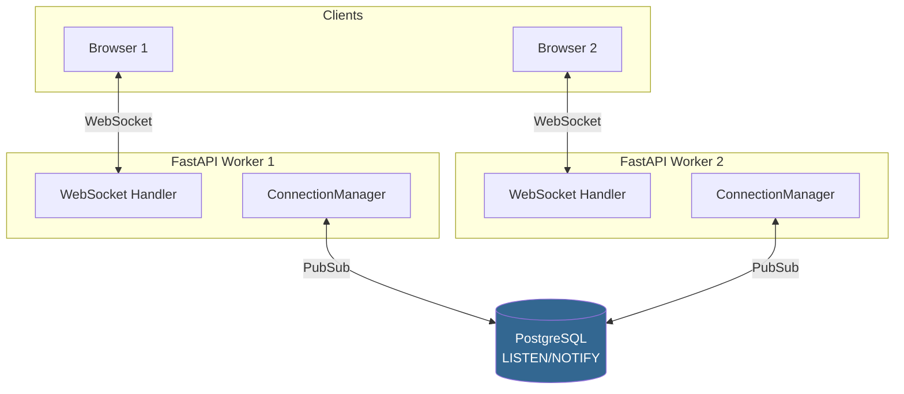

# Chat Module

Real-time чат с WebSocket, PubSub и интеграцией с внешними мессенджерами.

## Архитектура



!!! info "Cross-process messaging"
    Сообщения проходят через PostgreSQL `LISTEN/NOTIFY` (или Redis Pub/Sub) — это гарантирует доставку между всеми worker-процессами.

## Типы чатов

| Тип | Описание | Права по умолчанию |
|-----|----------|-------------------|
| `direct` | Личный чат 1-на-1 | Чтение, запись, pin |
| `group` | Групповой чат | Чтение, запись |
| `channel` | Канал (только админы пишут) | Только чтение |
| `record` | Чат привязанный к записи CRM | Чтение, запись |

## API — Messages

### Отправка сообщения

<span class="method-post">POST</span> `/chats/{chat_id}/messages`

```json
{
    "body": "Hello, World!",
    "attachments": [],
    "reply_to_id": null
}
```

### Получение сообщений

<span class="method-get">GET</span> `/chats/{chat_id}/messages?limit=50&before_id=100`

Пагинация курсором: `before_id` — загрузить сообщения старше указанного ID.

### Редактирование

<span class="method-patch">PATCH</span> `/chats/{chat_id}/messages/{message_id}`

```json
{
    "body": "Edited message text"
}
```

### Удаление

<span class="method-delete">DELETE</span> `/chats/{chat_id}/messages/{message_id}`

Soft delete — `is_deleted = true`.

### Pin / Unpin

<span class="method-post">POST</span> `/chats/{chat_id}/messages/{message_id}/pin`

```json
{"pinned": true}
```

### Реакции

<span class="method-post">POST</span> `/chats/{chat_id}/messages/{message_id}/reactions`

```json
{"emoji": "👍"}
```

Повторный вызов с тем же emoji — toggle (убирает реакцию).

## WebSocket Events

Клиент подключается к `/ws` и получает события:

```typescript
// Подключение
const ws = new WebSocket(`wss://api.fara.dev/ws?token=${token}`);

ws.onmessage = (event) => {
    const data = JSON.parse(event.data);

    switch (data.type) {
        case "new_message":
            // Новое сообщение
            addMessage(data.chat_id, data.message);
            break;

        case "message_edited":
            updateMessage(data.message_id, data.body);
            break;

        case "message_deleted":
            removeMessage(data.message_id);
            break;

        case "message_pinned":
            togglePin(data.message_id, data.pinned);
            break;

        case "reaction_update":
            updateReaction(data.message_id, data.reactions);
            break;
    }
};
```

## PubSub — Strategy Pattern

PubSub backend выбирается через `.env`:

=== "PostgreSQL (по умолчанию)"

    ```bash title=".env"
    PUBSUB__BACKEND=pg
    ```

    Использует `LISTEN/NOTIFY`. Просто, без доп. инфраструктуры.

=== "Redis"

    ```bash title=".env"
    PUBSUB__BACKEND=redis
    PUBSUB__REDIS_URL=redis://localhost:6379/0
    ```

    Выше throughput, не занимает соединение из asyncpg pool.

Переключение backend'а не требует изменения кода — Strategy pattern:

```python title="backend/base/crm/chat/websocket/pubsub/"
# pubsub/
# ├── __init__.py      # create_pubsub_backend() factory
# ├── base.py          # PubSubBackend (abstract)
# ├── pg_backend.py    # PostgreSQL LISTEN/NOTIFY
# └── redis_backend.py # Redis Pub/Sub
```

## Модели

### Chat

```python
class Chat(DotModel):
    __table__ = "chats"

    name: str = Char(max_length=255, required=True)
    chat_type: str = Selection(
        selection=[
            ("direct", "Личный"), ("group", "Группа"),
            ("channel", "Канал"), ("record", "Чат записи"),
        ],
        default="group",
    )
    creator_id: "User" = Many2one["User"](relation_table="users")
    is_archived: bool = Boolean(default=False)
```

### ChatMember

```python
class ChatMember(DotModel):
    __table__ = "chat_members"

    chat_id = Many2one["Chat"](relation_table="chats", required=True)
    user_id = Many2one["User"](relation_table="users", required=True)
    is_active = Boolean(default=True)
    is_admin = Boolean(default=False)
    can_read = Boolean(default=True)
    can_write = Boolean(default=True)
    can_pin = Boolean(default=False)
    can_invite = Boolean(default=False)
    can_delete_others = Boolean(default=False)
```

### Проверка прав

```python
# Shortcut-методы на ChatMember
await ChatMember.check_can_write(chat_id, user_id)
await ChatMember.check_can_pin(chat_id, user_id)
await ChatMember.check_admin(chat_id, user_id)

# Под капотом:
member = await ChatMember.check_membership(chat_id, user_id)  # или 403
if not member.has_permission("can_pin"):
    raise FaraException("PERMISSION_DENIED")
```
