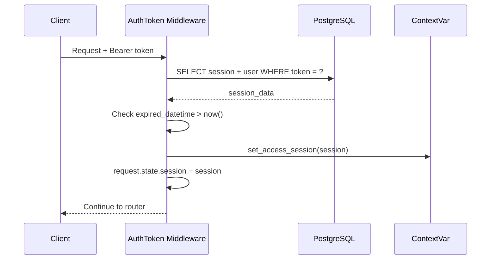

# Security Module

Аутентификация, авторизация, ACL и управление сессиями.

## Аутентификация

Bearer-токен в заголовке `Authorization`:

```http
Authorization: Bearer <token>
```

### Цепочка аутентификации



### Session

```python
# Создание сессии (при логине)
session = Session(
    user_id=user_id,
    token=secrets.token_urlsafe(64),
    ttl=3600,
    expired_datetime=datetime.now(tz=utc) + timedelta(hours=1),
    active=True,
)
await Session.create(session)
```

### Получение сессии в роутере

```python
@router.get("/me")
async def get_current_user(req: Request):
    session = req.state.session        # установлен middleware
    user_id = session.user_id.id       # session.user_id — объект User
    is_admin = session.user_id.is_admin

    return {"user_id": user_id, "is_admin": is_admin}
```

## Access Control (ACL)

DotORM поддерживает встроенную проверку прав на уровне ORM через `ContextVar`:

```python
from backend.base.system.dotorm.dotorm.access import (
    set_access_session,
    get_access_session,
)

# Устанавливается middleware автоматически
set_access_session(session)

# ORM проверяет при каждой операции:
await record.update(...)   # → _check_access(Operation.UPDATE)
await Model.create(...)    # → _check_access(Operation.CREATE)
await Model.search(...)    # → _check_access(Operation.READ) + domain filter
```

### Уровни доступа

1. **Table ACL** — может ли пользователь вообще читать/писать таблицу
2. **Row Rules** — видит ли пользователь конкретные записи (domain filter)

```python
class Product(DotModel):
    __table__ = "products"
    __access__ = {
        "read": True,        # все могут читать
        "create": "admin",   # только админы создают
        "update": "admin",
        "delete": "admin",
    }
```

## SystemSession

Для операций от имени системы (cron, post_init) используется `SystemSession`:

```python
from backend.base.crm.security.models.sessions import SystemSession
from backend.base.system.dotorm.dotorm.access import set_access_session

# Даёт полный доступ ко всем операциям
set_access_session(SystemSession(user_id=SYSTEM_USER_ID))
```

!!! warning "Только для серверного кода"
    `SystemSession` обходит все проверки доступа. Никогда не устанавливай его для пользовательских запросов.
