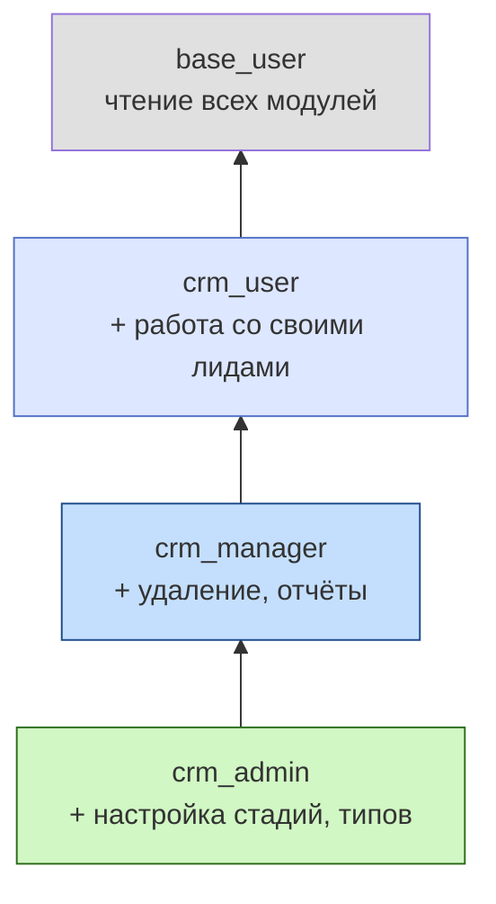
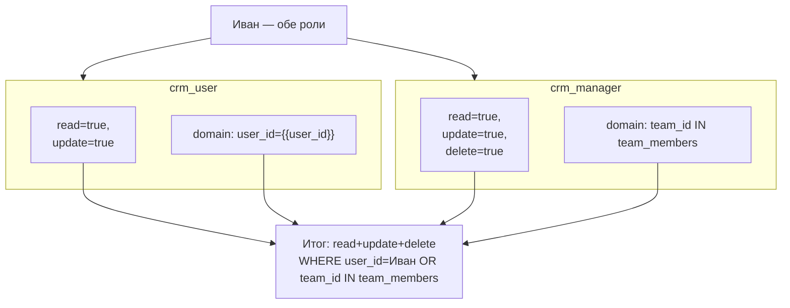

# Иерархия пользователей

В FARA пользователи и роли образуют две независимые, но связанные иерархии: **системные пользователи** (фиксированные ID, ставятся при инсталляции) и **наследование ролей** (через `based_role_ids`).

## Системные пользователи

При первом старте `users.app.post_init` создаёт четыре служебных аккаунта с **фиксированными ID**:

| ID | Логин | Назначение |
|----|-------|-----------|
| 1 | `admin` | Администратор системы (полный доступ через `is_admin=true`) |
| 2 | `system` | Системный аккаунт. Под ним работают cron, post_init, миграции — всё, что не привязано к живому пользователю |
| 3 | `default_internal` | Шаблон «Внутренний пользователь» — основа для копирования при создании новых сотрудников |
| 4 | `anonymous` | Анонимный пользователь для публичных endpoint-ов |

Константы из `backend/base/crm/users/models/users.py`:

```python
ADMIN_USER_ID = 1
SYSTEM_USER_ID = 2
TEMPLATE_USER_ID = 3
ANONYMOUS_USER_ID = 4
```

!!! warning "Порядок создания критичен"
    PostgreSQL serial назначает `id` строго по порядку INSERT. Поэтому в `users.app.post_init()` `_init_admin → _init_system → _init_template → _init_anonymous` идут именно в этом порядке. Если поменять — `id` поедут, и константы не совпадут с реальными записями.

    Чтобы это работало стабильно, у `users.app` явно задан `sequence: 3` (после `security: 1` и `languages: 2`), чтобы post_init выполнился до бизнес-модулей.

### Шаблонный пользователь

`default_internal` (id=3) — не для логина, а как **источник по умолчанию** для новых сотрудников: при создании пользователя через UI/API его настройки (роли, темы, домашняя страница) копируются с шаблона. Так настройки команды сразу выставлены.

```python
# При создании нового сотрудника:
new_user = User(
    name="Иван Иванов",
    login="ivan",
    template_id=TEMPLATE_USER_ID,  # копируем настройки шаблона
)
```

## Иерархия ролей через `based_role_ids`

Роль может **наследовать** другую через `based_role_ids` (Many2many, многих к многим — роль может наследовать сразу несколько). Все права (`acl_ids`, `rule_ids`) у такой роли = свои + унаследованные.



В этом примере `crm_admin` автоматически получает всё, что есть у `crm_manager`, `crm_user` и `base_user`. Не нужно прописывать дублирующий ACL.

### Реализация — рекурсивный CTE

```python
all_roles = await Role.get_all_roles([crm_admin_id])
# → [crm_admin_id, crm_manager_id, crm_user_id, base_user_id]
```

Один SQL-запрос с рекурсивным CTE собирает всё дерево вверх:

```sql
WITH RECURSIVE role_tree AS (
    SELECT unnest($1::int[]) AS role_id
    UNION
    SELECT rb.based_role_id
    FROM role_tree rt
    JOIN role_based_many2many rb ON rb.role_id = rt.role_id
)
SELECT DISTINCT role_id FROM role_tree;
```

!!! info "N+1 не возникает"
    Раскрытие иерархии — один SQL-запрос независимо от глубины. Это важно: на пользователя с 5-ю ролями глубиной 4 будет один запрос, не 20.

## Объединение прав при наследовании

Когда у пользователя несколько ролей (включая унаследованные), их права объединяются:

| Уровень | Правило объединения |
|---------|---------------------|
| **ACL** | OR между ролями. Если хоть одна роль разрешает `read` для модели — пользователь читает |
| **Rules** | OR между Rule всех ролей пользователя на одну модель + операцию |

### Пример



## Админ обходит всё

Поле `User.is_admin = true` — ярлык. Если он стоит:

- **ACL не проверяется** — доступ ко всем CRUD на всех моделях.
- **Rules не применяются** — видит все строки.

Это предусмотрено для аккаунта `admin` (id=1). Для обычных пользователей `is_admin` не выставляется — они должны проходить через ACL/Rules.

```python
@property
def has_full_access(self) -> bool:
    return self.user_id.is_admin
```

## См. также

- [Роли и правила](roles-and-rules.md) — модели Role, AccessList, Rule подробно.
- [Security Module](../modules/security.md) — аутентификация и сессии.
