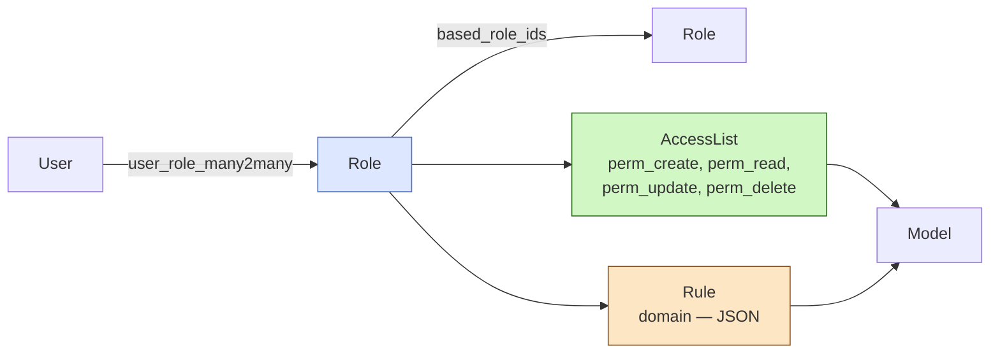
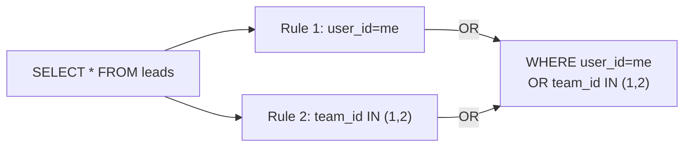
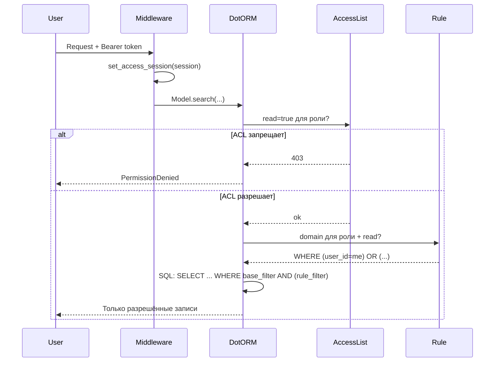

# Роли и правила

Система прав FARA устроена в три слоя:

1. **Роли** (`Role`) — что-то вроде «должности»: набор разрешений, который можно выдать пользователю.
2. **ACL** (`AccessList`) — права на уровне таблицы: может ли роль читать/создавать/изменять/удалять записи модели в принципе.
3. **Rules** (`Rule`) — правила на уровне строк: какие именно записи модели видит/изменяет роль.

ACL отвечает на вопрос «*может ли пользователь работать с этой таблицей вообще*», Rules — «*с какими записями этой таблицы*».

## Архитектура



## Модель Role

<div class="field" markdown>
`code` <span class="field-type">Char(64)</span> <span class="field-flag">unique</span>

Машинное имя роли — `base_user`, `crm_manager`, `viewer`. По нему роль ищется в коде.
</div>

<div class="field" markdown>
`name` <span class="field-type">Char(128)</span>

Человекочитаемое название для UI.
</div>

<div class="field" markdown>
`based_role_ids` <span class="field-type">Many2many&lt;Role&gt;</span>

Иерархия: «эта роль наследует права от...». Если `crm_manager.based_role_ids = [base_user]` — менеджер автоматически получает все права `base_user` плюс свои собственные.
</div>

<div class="field" markdown>
`acl_ids` <span class="field-type">One2many&lt;AccessList&gt;</span>

Список ACL — прав на конкретные модели. Один ACL = одна модель + флаги CRUD.
</div>

<div class="field" markdown>
`rule_ids` <span class="field-type">One2many&lt;Rule&gt;</span>

Список правил — domain-фильтров на записи.
</div>

### Получение всех ролей пользователя с учётом иерархии

```python
all_roles = await Role.get_all_roles([user_role_id])
# Возвращает [user_role_id] + все based_role_ids рекурсивно.
# Использует рекурсивный CTE — один запрос вместо N+1.
```

## ACLPostInitMixin — декларативное задание прав

В `post_init` модуля права обычно описываются через миксин:

```python title="backend/base/crm/leads/app.py"
from backend.base.crm.security.acl_post_init_mixin import (
    ACLPostInitMixin,
    ACLPerms,
    ACL,
)

class LeadsApp(ACLPostInitMixin, App):
    # Права для базовой роли base_user
    BASE_USER_ACL = {
        "lead": ACL.FULL,
        "lead_stage": ACLPerms(create=True, read=True, update=True, delete=False),
    }

    # Права для других ролей — словарь role_code → {model → perms}
    ROLE_ACL = {
        "manager": {
            "lead": ACL.NO_DELETE,
        },
        "viewer": {
            "lead": ACL.READ_ONLY,
        },
    }

    async def post_init(self, app: FastAPI):
        await super().post_init(app)
        await self._init_acl(app.state.env)
```

### Готовые пресеты

| Пресет | C | R | U | D | Использование |
|--------|---|---|---|---|---------------|
| `ACL.FULL` | ✓ | ✓ | ✓ | ✓ | Полный доступ |
| `ACL.READ_ONLY` | — | ✓ | — | — | Просмотр |
| `ACL.NO_DELETE` | ✓ | ✓ | ✓ | — | Менеджеры (не удаляют) |
| `ACL.NO_CREATE` | — | ✓ | ✓ | ✓ | Можно править существующее |
| `ACL.NO_ACCESS` | — | — | — | — | Запрет |
| `ACL.CREATE_READ` | ✓ | ✓ | — | — | Только чтение и создание |

Если пресета не хватает — `ACLPerms(create=..., read=..., ...)` с произвольными флагами.

!!! info "Идемпотентность"
    `_init_acl` создаёт ACL только если для пары `(role_id, model_id)` ещё нет записи. При повторном запуске `post_init` ничего не дублируется.

## Rules — фильтрация на уровне строк

ACL пропустил пользователя в таблицу — теперь Rules решают, какие именно записи он видит. Это делается через `domain` — JSON-выражение в формате DotORM-фильтра.

<div class="field" markdown>
`domain` <span class="field-type">JSON</span>

Список условий вида `[(field, op, value), ...]`. Все условия объединяются через AND.

```json
[
  ["user_id", "=", "{{user_id}}"],
  ["active", "=", true]
]
```

Подстановки:

- `{{user_id}}` или `{{user.id}}` — ID текущего пользователя.
</div>

<div class="field" markdown>
`role_id` <span class="field-type">Many2one&lt;Role&gt;</span> <span class="field-flag">nullable</span>

Роль, на которую распространяется правило. `NULL` = для всех.
</div>

<div class="field" markdown>
`perm_create / perm_read / perm_update / perm_delete` <span class="field-type">bool</span>

Для каких операций применяется domain. Например, можно «читать всё, но обновлять только своё».
</div>

### OR между правилами

Если у пользователя несколько правил на одну модель + операцию, они объединяются через **OR**: достаточно попасть под любое правило, чтобы запись стала видна.



### Примеры

=== "Только свои записи"

    ```json
    [["user_id", "=", "{{user_id}}"]]
    ```

    Менеджер видит только свои лиды.

=== "Свои + команды"

    ```json
    [
      ["user_id", "=", "{{user_id}}"],
      ["team_id", "in", [1, 2, 3]]
    ]
    ```

    Все условия объединены **AND**: «свои И из определённых команд».
    Если хочется «свои ИЛИ из команд» — это два разных Rule на одну модель/операцию (объединятся OR на уровне системы).

=== "Только активные"

    ```json
    [["active", "=", true]]
    ```

    Архивные записи скрыты от роли.

## Поток проверки доступа



## SystemSession — обход проверок

Для серверного кода (cron, post_init, миграции) используется `SystemSession`:

```python
from backend.base.crm.security.models.sessions import SystemSession
from backend.base.system.dotorm.dotorm.access import set_access_session

# Полный доступ ко всем операциям, без проверок Rule
set_access_session(SystemSession(user_id=SYSTEM_USER_ID))
```

!!! warning "Только для серверного кода"
    `SystemSession` обходит ACL и Rules. Никогда не подставляй её для пользовательских запросов — это эквивалент `sudo`.

## Связь с пользователем

```python
# Назначить роль
user.role_ids = [role_admin, role_manager]
await user.save()

# Получить пользователя по роли
managers = await User.search(filter=[("role_ids", "=", manager_role_id)])
```

## См. также

- [Иерархия ролей](hierarchy.md) — как наследование через `based_role_ids` влияет на права в реальных сценариях.
- [Security Module](../modules/security.md) — аутентификация, сессии, ContextVar.
