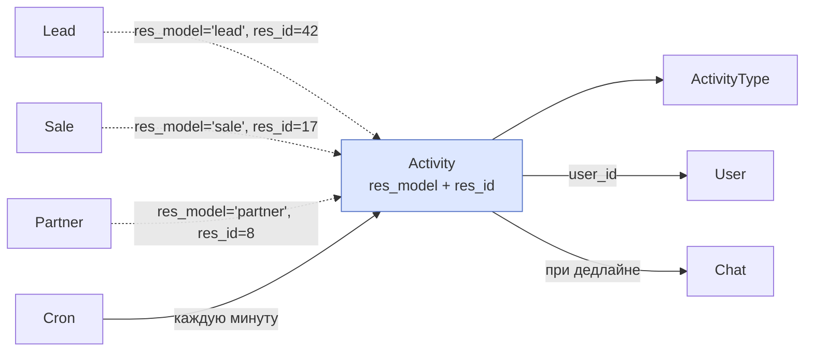
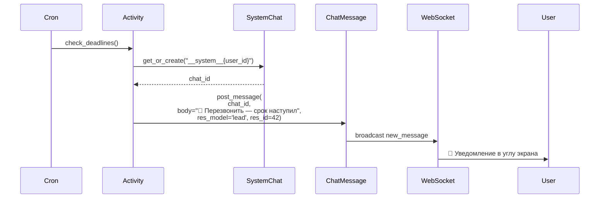

# Activity — задачи и дедлайны

Модуль `activity` — лёгкие задачи с дедлайнами, привязанные к любым записям CRM (лидам, сделкам, контактам). При наступлении дедлайна автоматически уведомляет ответственного через системный чат.

Ключевая особенность — **полиморфная привязка**: одна и та же модель `Activity` обслуживает все сущности CRM через пару полей `res_model` + `res_id`. Не нужны отдельные таблицы `lead_activity`, `sale_activity` и т.д.

## Архитектура



## Модель Activity

<div class="field" markdown>
`res_model` <span class="field-type">Char(255)</span> <span class="field-flag">required</span>

Имя модели записи: `lead`, `sale`, `partner`. Совпадает с `__table__` соответствующей DotModel.
</div>

<div class="field" markdown>
`res_id` <span class="field-type">Integer</span> <span class="field-flag">required</span>

ID записи. Не FK на конкретную таблицу — связь полиморфная.
</div>

<div class="field" markdown>
`activity_type_id` <span class="field-type">Many2one&lt;ActivityType&gt;</span> <span class="field-flag">required</span>

Тип активности — справочник: «Звонок», «Встреча», «Письмо», «Задача».
</div>

<div class="field" markdown>
`summary` <span class="field-type">Char(255)</span>

Короткое описание для UI и уведомления.
</div>

<div class="field" markdown>
`note` <span class="field-type">Text</span>

Подробное описание (markdown / plain).
</div>

<div class="field" markdown>
`date_deadline` <span class="field-type">Datetime</span> <span class="field-flag">required</span> <span class="field-flag">indexed</span>

Дедлайн в UTC. Индексирован — cron быстро находит просроченные.
</div>

<div class="field" markdown>
`user_id` <span class="field-type">Many2one&lt;User&gt;</span> <span class="field-flag">required</span> <span class="field-flag">indexed</span>

Кому назначена. Default — текущий пользователь из сессии.
</div>

<div class="field" markdown>
`state` <span class="field-type">Selection</span> <span class="field-flag">indexed</span>

`planned` (запланирована) → `today` (сегодня дедлайн) → `overdue` (просрочена) → `done`/`cancelled`. Cron сам переводит между состояниями.
</div>

<div class="field" markdown>
`done` / `done_datetime` <span class="field-type">bool / Datetime</span>

Выполнена ли + когда. После `done=true` cron перестаёт интересоваться.
</div>

<div class="field" markdown>
`notification_sent` <span class="field-type">bool</span>

Флаг «уведомление отправлено». Защита от повторных уведомлений: cron бежит каждую минуту, но напомнит только один раз.
</div>

## Полиморфная привязка

`(res_model, res_id)` — это пара полей, по которой построен составной индекс:

```python
__indexes__ = [("res_model", "res_id")]
```

Это даёт быстрый поиск всех активностей по конкретной записи:

```python
# Все активности лида #42
activities = await Activity.search(
    filter=[("res_model", "=", "lead"), ("res_id", "=", 42)],
)

# Все активности любого типа на сегодня
today_activities = await Activity.search(
    filter=[("state", "=", "today"), ("user_id", "=", current_user_id)],
)
```

!!! info "Нет FK — нет каскада"
    Поскольку `res_model + res_id` это не настоящий FK, удаление лида **не удаляет** его активности автоматически. На практике это решается двумя путями:

    1. **Soft delete** записей — лид помечается `active=false`, а не удаляется.
    2. **Cron-уборщик** — раз в день удаляет активности, у которых нет привязанной записи.

## Создание

```python
await Activity.create_for_record(
    res_model="lead",
    res_id=lead.id,
    activity_type_id=type_call_id,
    user_id=manager.id,
    summary="Перезвонить по поводу заказа",
    days=2,  # дедлайн через 2 дня от сейчас
)
```

`days` — удобный шорткат. Если нужно точное время — передавай `date_deadline=datetime(...)` напрямую.

## Cron — главный механизм Activity

Каждую минуту запускается `Activity.check_deadlines()` (cron-задача `Activity: check deadlines`):

```python
@hybridmethod
async def check_deadlines(self):
    now = datetime.now(timezone.utc)

    # 1) Все просроченные → state='overdue'
    overdue = await self.search(filter=[
        ("date_deadline", "<", now),
        ("done", "=", False),
        ("state", "!=", "overdue"),
        ("state", "!=", "cancelled"),
    ])
    await Activity.update_bulk([a.id for a in overdue], Activity(state="overdue"))

    # 2) Все наступившие, по которым ещё не отправляли уведомление
    pending = await self.search(filter=[
        ("date_deadline", "<=", now),
        ("done", "=", False),
        ("notification_sent", "=", False),
        ("state", "!=", "cancelled"),
    ])
    for activity in pending:
        await self._send_notification(...)
        await activity.update(Activity(notification_sent=True))
```

**Два прохода**:

1. Перевести в `overdue` всё, что прошло дедлайн (без отправки — может быть давно).
2. Послать уведомление по тем, что только что наступили (`notification_sent=False`).

Это разделение нужно, чтобы при первом старте cron'а после простоя система не завалила пользователя 100 уведомлениями о просроченных задачах за месяц — `notification_sent=true` уже стоит у тех, что были обработаны.

## Уведомления — системный чат

`_send_notification` ищет (или создаёт) **системный чат** пользователя и пишет в него:



**Системный чат** — `Chat(chat_type='direct', is_internal=true, name='__system__{user_id}')`. Только пользователь и система. Уведомления о дедлайнах, событиях системы, ошибках интеграций приходят сюда.

`res_model` + `res_id` сохраняются в `ChatMessage` — клик по уведомлению открывает соответствующую запись (лид, сделку и т.д.).

!!! warning "Поле в модели ChatMessage пока закомментировано"
    На уровне `Activity._send_notification` параметры `res_model`/`res_id` уже передаются в `ChatMessage.post_message`, но в самой модели поля закомментированы. После раскомментирования и миграции БД клик по уведомлению начнёт переходить на привязанную запись.

## Activity types

Справочник `ActivityType` — для UI: иконки, цвета, дефолтные дедлайны.

```python
await ActivityType.create(payload=ActivityType(
    name="Звонок",
    icon="phone",
    color="green",
    default_days_offset=1,  # завтра
))
```

## Связь с другими модулями

| Модуль | Использование |
|--------|--------------|
| `cron` | Запускает `check_deadlines` каждую минуту |
| `chat` | Создаёт системный чат, шлёт сообщения-уведомления |
| `users` | Системный пользователь (`SYSTEM_USER_ID`) — автор уведомлений |
| `chat_web_push` | Если включён — пушит уведомление в браузер/PWA |

## См. также

- [Cron — фоновые задачи](cron.md) — общий механизм запуска
- [Chat Module](../modules/chat.md) — куда приходят уведомления
- [Чат и звонки → Архитектура](../modules/chat-architecture.md) — что такое системный чат
