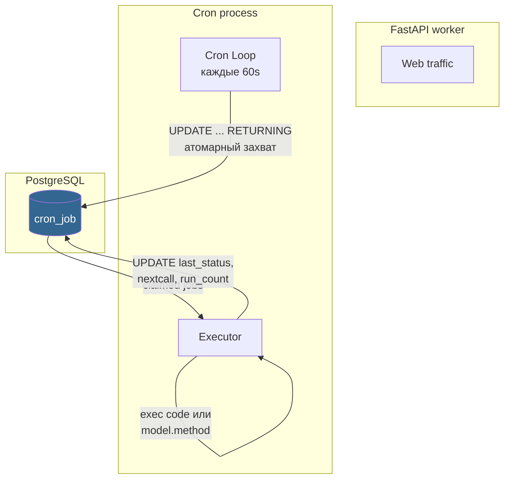
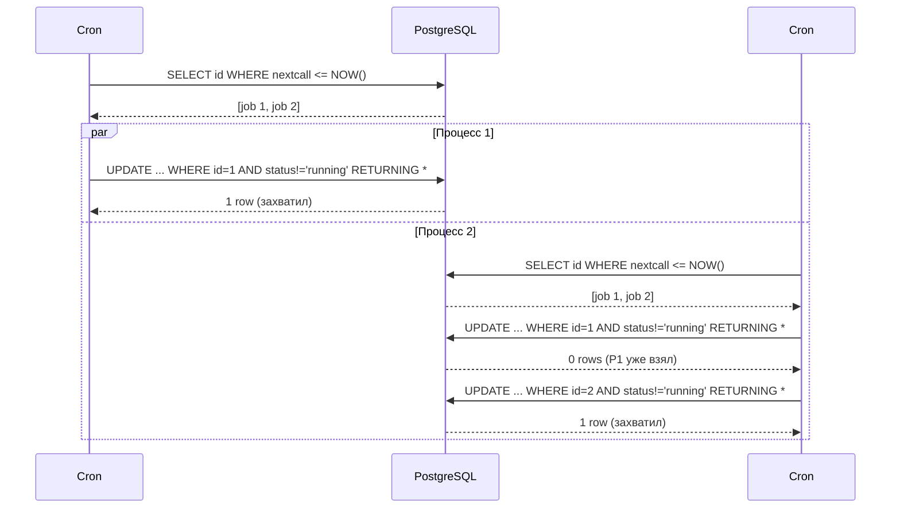

# Cron — фоновые задачи

Кастомный планировщик FARA. Хранит задачи в таблице `cron_job`, выполняет их в отдельном процессе. Атомарный захват через PostgreSQL — безопасно работает в multi-worker окружении.

## Архитектура



Главные особенности:

- **Отдельный процесс** (`backend/main_cron.py`) — не делит лимит коннектов с web-воркерами и не падает при их рестарте.
- **Атомарный захват** через `UPDATE ... WHERE ... AND nextcall <= NOW() RETURNING *` — если два процесса cron поднялись параллельно, одну задачу возьмёт только один.
- **Stale-locks**: если процесс упал во время выполнения, другой подхватит задачу через `lastcall + timeout < NOW()`.
- **Таймаут** на каждый job через `asyncio.wait_for` — зависший job не блокирует другие.

## Модель CronJob

<div class="field" markdown>
`name` <span class="field-type">Char(255)</span> <span class="field-flag">required</span>

Название задачи. Используется в логах: `[FARA CRON] Executing: {name} (id={id})`.
</div>

<div class="field" markdown>
`active` <span class="field-type">bool</span>

Активна ли. Неактивные не запускаются — так можно временно отключить задачу без удаления.
</div>

<div class="field" markdown>
`code` <span class="field-type">Text</span>

Произвольный Python-код. Выполняется в окружении с доступом к `env`. Например:
```python
async def __cron_task__():
    await env.models.activity.check_deadlines()
```
</div>

<div class="field" markdown>
`model_name` + `method_name` <span class="field-type">Char</span>

Альтернатива `code`: указать модель и метод. Метод должен быть `@hybridmethod` или `@classmethod`. `args`/`kwargs` (JSON-строки) передаются как аргументы.
</div>

<div class="field" markdown>
`interval_number` + `interval_type` <span class="field-type">Integer + Selection</span>

Интервал между запусками. Типы: `minutes`, `hours`, `days`, `weeks`, `months`. Например, `interval_number=5, interval_type=minutes` — каждые 5 минут.
</div>

<div class="field" markdown>
`numbercall` <span class="field-type">Integer</span>

Сколько раз ещё должен выполниться. `-1` = бесконечно. После каждого запуска уменьшается. Когда становится 0 — задача автоматически становится `active=false`.
</div>

<div class="field" markdown>
`nextcall` / `lastcall` <span class="field-type">Datetime</span>

Когда должен быть следующий запуск / когда был последний. После запуска `nextcall = now() + interval`.
</div>

<div class="field" markdown>
`last_status` <span class="field-type">Selection</span>

`pending` (ждёт), `running` (выполняется), `success`, `error`. `last_error` хранит traceback для отладки.
</div>

<div class="field" markdown>
`timeout` <span class="field-type">Integer</span>

Максимальная длительность в секундах. По истечении — задача снимается, статус `error`. Default 300s (5 мин).
</div>

<div class="field" markdown>
`priority` <span class="field-type">Integer</span>

При множестве готовых задач захватываются по возрастанию `priority` — сначала меньшие (более приоритетные).
</div>

## Создание cron-задачи

### Через классовый метод

```python
from backend.base.system.cron.models.cron_job import CronJob

await CronJob.create_job(
    name="Activity: check deadlines",
    model_name="activity",
    method_name="check_deadlines",
    interval_number=1,
    interval_type="minutes",
)
```

### Через произвольный код

```python
await CronJob.create_job(
    name="Cleanup old sessions",
    code="""
async def __cron_task__():
    await env.models.session.cleanup_expired()
""",
    interval_number=1,
    interval_type="hours",
)
```

В коде доступны:

- `env` — глобальное окружение (`env.models`, `env.apps`, `env.settings`).
- Любые встроенные Python-модули (через `import`).

!!! warning "Безопасность кода"
    Поле `code` — это `exec()` под админскими правами. Доступ к таблице `cron_job` через UI должен быть только у `is_admin=true`. Для обычных пользователей запрети edit на уровне ACL.

## Атомарный захват — как это работает

Проблема: два cron-процесса (например, после рестарта) одновременно увидели задачу с `nextcall <= now()`. Без синхронизации оба её выполнят.

Решение FARA — захват через `UPDATE`:

```sql
UPDATE cron_job
SET last_status = 'running',
    lastcall = NOW()
WHERE id = ANY($1)                       -- кандидаты
  AND active = true
  AND (
    last_status != 'running'              -- не выполняется сейчас
    OR (lastcall + make_interval(secs => timeout) < NOW())  -- или выполняется давно (stale lock)
  )
  AND nextcall <= NOW()
RETURNING *;
```

`UPDATE ... RETURNING` атомарен на уровне строки. Только один процесс получит запись, второй увидит пустой результат.

**Stale-lock detection**: условие `lastcall + timeout < NOW()` в `OR` снимает блокировку, если предыдущий процесс упал и не успел поставить `success`/`error`. Таймаут — это время, которое мы готовы ждать, прежде чем считать «процесс умер».



## Запуск cron

```bash title="отдельный процесс"
python backend/main_cron.py
```

В Docker-композе FARA это отдельный сервис рядом с `backend`:

```yaml
cron:
  build: .
  command: python backend/main_cron.py
  depends_on:
    postgres:
      condition: service_healthy
  environment:
    # те же DB-переменные что у backend
    ...
```

### Settings

`backend/base/system/cron/settings.py`:

| Переменная | По умолчанию | Описание |
|------------|-------------|----------|
| `CRON__ENABLED` | `true` | Включён ли cron вообще |
| `CRON__CHECK_INTERVAL` | `60` | Как часто (сек) опрашивать БД |
| `CRON__MAX_THREADS` | `2` | Сколько одновременных задач выполнять |

```bash title=".env"
CRON__CHECK_INTERVAL=30
CRON__MAX_THREADS=4
```

## Системный пользователь

Cron-задачи выполняются под `SystemSession(user_id=SYSTEM_USER_ID)` — это даёт полный доступ ко всем моделям, минуя ACL и Rules. Это намеренно: cron — служебный код, не пользовательский.

```python
# Внутри _execute_job()
set_access_session(SystemSession(user_id=SYSTEM_USER_ID))
try:
    await self._run_job_code(job_data)
finally:
    set_access_session(None)
```

## Типичные cron-задачи в FARA

| Имя | Интервал | Что делает |
|-----|---------|-----------|
| `Activity: check deadlines` | 1 минута | Находит просроченные активности → шлёт уведомления в чат |
| `Auth: deactivate expired sessions` | 5 минут | Помечает истёкшие сессии `active=false` |
| `Attachments: cleanup orphan files` | 1 день | Удаляет вложения без `res_model`/`res_id` старше N дней |
| `Chat: archive inactive chats` | 1 неделя | Архивирует чаты без активности 90+ дней |

## См. также

- [Activity — задачи и дедлайны](activity.md) — главный потребитель cron в FARA.
