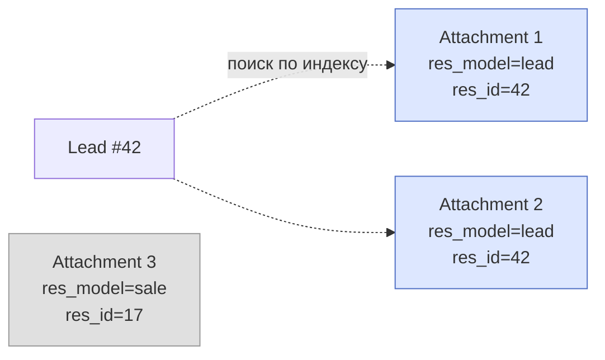

# Локальное хранилище (FileStore)

`FileStoreStrategy` — провайдер по умолчанию. Хранит файлы прямо на диске сервера, в папке, путь к которой задан в системных настройках.

## Полиморфная таблица attachment

Прежде чем разбирать саму стратегию, важно понимать **общую модель** `Attachment`. Все провайдеры (FileStore, Google Drive, Yandex.Disk) пишут в одну и ту же таблицу `attachment` — отличается только то, как они работают с физическим файлом.

`Attachment` — **полиморфная таблица**: одна модель обслуживает все сущности CRM через пару полей `res_model` + `res_id`. Не нужны отдельные `lead_attachment`, `sale_attachment`, `partner_attachment` — все они единые `attachment` с разными значениями `res_model`.

```python
class Attachment(AuditMixin, DotModel):
    __table__ = "attachment"

    # Составной индекс — для полиморфной выборки
    # всех вложений конкретной записи (основной паттерн доступа)
    __indexes__ = [("res_model", "res_id")]

    res_model: str | None = Char(
        string="Resource Model",
        help="Имя модели, к которой привязано вложение",
    )
    res_id: int | None = Integer(
        string="Resource ID",
        help="ID записи, к которой привязано вложение",
    )
    # ... остальные поля: name, mimetype, size, checksum, storage_id и т.д.
```

### Зачем составной индекс

Главный сценарий доступа: «**покажи все файлы лида #42**». Это запрос:

```sql
SELECT * FROM attachment WHERE res_model = 'lead' AND res_id = 42;
```

Без составного индекса PostgreSQL пришлось бы сканировать всю таблицу или комбинировать два отдельных индекса. С `INDEX(res_model, res_id)` — мгновенный point-lookup даже на миллионах записей.



### Цена полиморфизма

У `(res_model, res_id)` нет настоящего FK — это просто два независимых поля. Из этого:

- **Удаление лида не каскадирует на attachment**. Если `Lead.delete(42)` — записи в `attachment` останутся «висящими». Нужно либо soft-delete, либо cleanup-крон, который раз в сутки удаляет attachment без существующего родителя.
- **Нет JOIN с FK constraint**. Запрос «лиды с количеством файлов» делается через `LEFT JOIN attachment a ON a.res_model='lead' AND a.res_id = lead.id`.
- **Нет автокомплита в Pydantic-схемах** — `res_model='lead'` это строка, а не enum. Опечатка в коде может тихо привести к привязке, которую никто не найдёт.

Это компромисс. Альтернатива — отдельная таблица для каждой связи — масштабируется хуже, и API CRUD пришлось бы дублировать N раз.

---

## Когда выбирать FileStore

- **Dev-окружение** — никакой настройки.
- **Single-server деплой** — нет необходимости в облаке.
- **Чувствительные данные** — файлы не покидают периметр сервера.
- **Bandwidth-light операции** — превью изображений, аватарки.

Когда **не подходит**:

- Multi-server деплой (worker А не видит файлы worker'а Б).
- Долговременное хранение без бэкапа диска.
- Доступ пользователю напрямую (без скачивания через API).

## Где лежат файлы

```python
DEFAULT_FILESTORE_PATH = os.path.join(os.getcwd(), "filestore")
```

По умолчанию — папка `filestore/` рядом с `main.py`. Переопределяется в системных настройках через ключ `attachments.filestore_path`.

В Docker-композе FARA это volume `filestore_docker`, монтированный в `/app/filestore`:

```yaml title="docker-compose.yml"
services:
  backend:
    volumes:
      - filestore_docker:/app/filestore
```

!!! warning "Сохраняйте volume при пересборке"
    `docker compose down` без флагов не сносит volumes. Но `docker volume rm faracrm_filestore_docker` уничтожит **все** загруженные файлы. Делать только сознательно.

## Структура папок на диске

`_build_file_path()` собирает путь так:

```
{base_path}/{res_model}/{res_id}/{filename}
```

Например:

```
filestore/
├── lead/
│   ├── 42/
│   │   ├── contract.pdf
│   │   └── photo.jpg
│   └── 43/
│       └── proposal.docx
└── partner/
    └── 17/
        └── logo.png
```

Точки в `res_model` заменяются на `/`: `partner.contact` → `partner/contact/`.

Структура отражает полиморфную таблицу один-в-один: путь на диске = `res_model / res_id / filename`. Это упрощает ручную инспекцию (можешь зайти в `filestore/lead/42/` и сразу увидеть все файлы лида) и бэкап.

## Безопасность имён файлов

Имена прогоняются через `sanitize_filename()`. Удаляются:

- Control-символы `\x00..\x1F`, `\x7F` — ломают `open()`, шеллы, HTTP-заголовки.
- Path separators `/` `\` — иначе path traversal (загрузить файл `../../etc/passwd`).
- Windows-reserved `<> : " | ? *`.
- Зарезервированные имена `CON`, `PRN`, `AUX`, `NUL`, `COM1..9`, `LPT1..9`.

Длина имени ограничена 255 байтами (лимит ext4/NTFS/APFS).

## API стратегии

### create_file

```python
result = await strategy.create_file(
    storage=storage,
    attachment=attachment,
    content=b"...bytes...",
    filename="contract.pdf",
    mimetype="application/pdf",
)
# result == {
#   "storage_file_id": "<sha256-hash>",
#   "storage_file_url": "/lead/42/contract.pdf",
#   "storage_parent_id": "/lead/42",
#   "storage_parent_name": "42",
# }
```

`storage_file_id` — SHA256 от содержимого: служит как идентификатор для верификации целостности и для ускоренного дедуплицирования.

### read_file

```python
content = await strategy.read_file(storage, attachment)
# content: bytes | None — None если файл удалён вручную с диска
```

Чтение асинхронное (`aiofiles`), не блокирует event loop.

### delete_file

Удаляет файл и родительскую папку, если она опустела (только до уровня `base_path` — корень не трогается).

## Особенности

- **Атомарная запись**: файл сначала пишется во временный, потом `os.rename()` атомарно подменяет старый. Если запись прервалась — на диске остаётся либо старая, либо новая версия, но не половинка.
- **Hash в имени файла НЕ хранится** — имя такое же как в БД. Гарантия уникальности — папка `{res_id}` отделяет файлы разных записей.
- **Дублей не делаем** — если два разных лида загрузили одинаковый файл, на диске лежат две копии. Дедуплицирование через `storage_file_id` (SHA256) можно сделать поверх, но в базовой стратегии нет.

## Бэкап

Самый простой путь:

```bash
# Раз в сутки
tar -czf /backup/filestore-$(date +%F).tar.gz /app/filestore
```

Через cron-задачу самой FARA (внутри контейнера это сложнее — лучше через хостовый cron).

Для надёжного хранения лучше использовать облачный провайдер ([Google](google.md) или [Yandex](yandex.md)) с включённым `enable_one_way_cron` — тогда FileStore работает как локальный кэш, а оригинал лежит в облаке.

## См. также

- [Обзор вложений](index.md) — общая архитектура с Strategy/Storage/Route/Cache
- [Google Drive](google.md) — облачный провайдер
- [Яндекс.Диск](yandex.md) — облачный провайдер
