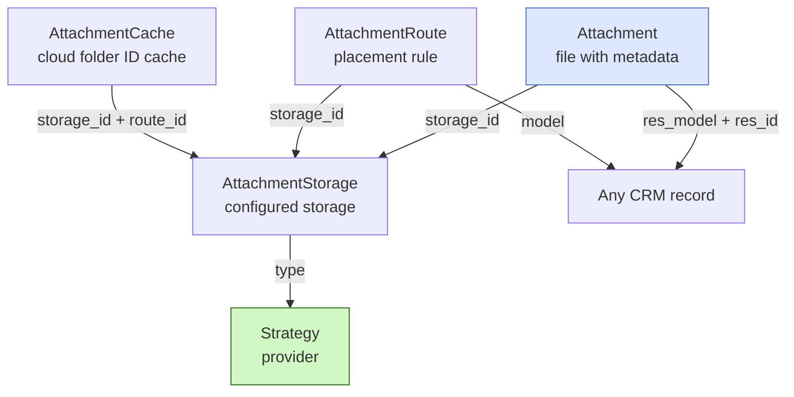

# Attachments — overview

The `attachments` module manages files across all of FARA. Supports multiple storage providers (local disk, Google Drive, Yandex.Disk) through the Strategy pattern. Only one storage can be active — it accepts new files.

## Architecture

Four related entities:



| Class | Stores | Example |
|-------|--------|---------|
| `Attachment` | File + polymorphic link | `name="contract.pdf", res_model="sale", res_id=42` |
| `AttachmentStorage` | Provider configuration | "Office's Google Drive" — type=google, active=true |
| `AttachmentRoute` | Folder template | "sale → Sales Orders/SO-{id}-{name}" |
| `AttachmentCache` | Cloud folder IDs | "storage=2 + sale#42 → folder_id=abc123" |
| `Strategy` | Provider work logic | `FileStoreStrategy`, `GoogleDriveStrategy`, `YandexDiskStrategy` |

## Strategy pattern

`StorageStrategyBase` (in `attachments/strategies/strategy.py`) is the base class. Each provider implements its own subclass:

```python
class StorageStrategyBase(ABC):
    strategy_type: str = ""

    @abstractmethod
    async def create_file(self, storage, attachment, content, filename, ...): ...

    @abstractmethod
    async def read_file(self, storage, attachment) -> bytes | None: ...

    @abstractmethod
    async def update_file(self, storage, attachment, content=None, ...): ...

    @abstractmethod
    async def delete_file(self, storage, attachment) -> bool: ...

    # Optional — for cloud storage
    async def create_folder(self, storage, folder_name, parent_id=None): ...
    async def get_folder_path(self, storage, res_model, res_id): ...
    async def get_credentials(self, storage): ...
    async def validate_connection(self, storage) -> bool: ...
```

Registration:

```python
from backend.base.crm.attachments.strategies import register_strategy

class GoogleDriveStrategy(StorageStrategyBase):
    strategy_type = "google"
    ...

register_strategy(GoogleDriveStrategy)
```

After registration, `AttachmentStorage(type="google")` will automatically work through this strategy.

## Polymorphic link

Like `Activity`, `Attachment` links to any record via `res_model` + `res_id`:

```python
# Attach a file to a lead
await Attachment.create_file(
    res_model="lead",
    res_id=lead.id,
    name="Contract.pdf",
    content=file_bytes,
    mimetype="application/pdf",
)

# Get all files of a lead
attachments = await Attachment.search(
    filter=[("res_model", "=", "lead"), ("res_id", "=", lead.id)],
)
```

This is cheaper than having an FK on each table. Downside — no cascade on deletion (see below).

## What's next

- [Local storage](filestore.md) — `FileStoreStrategy`, simple disk write
- [Google Drive](google.md) — OAuth, Shared Drives, API specifics
- [Yandex.Disk](yandex.md) — REST API, redirect quirks
