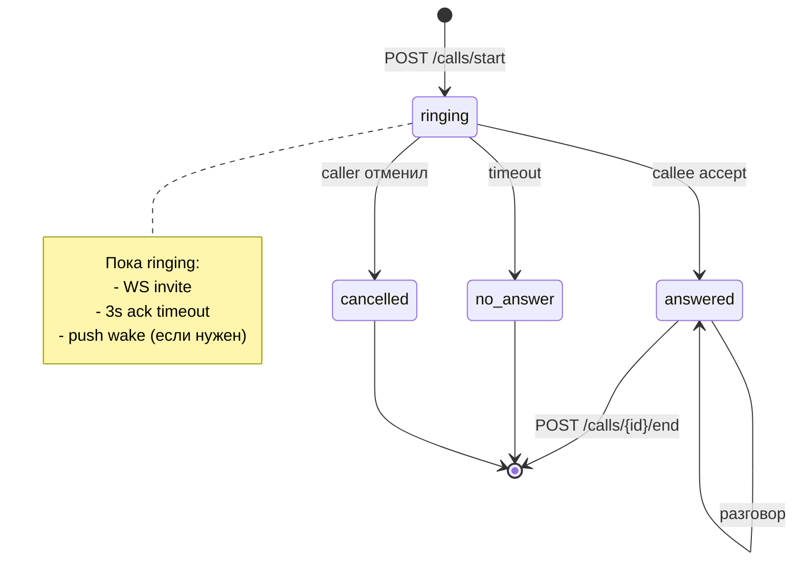
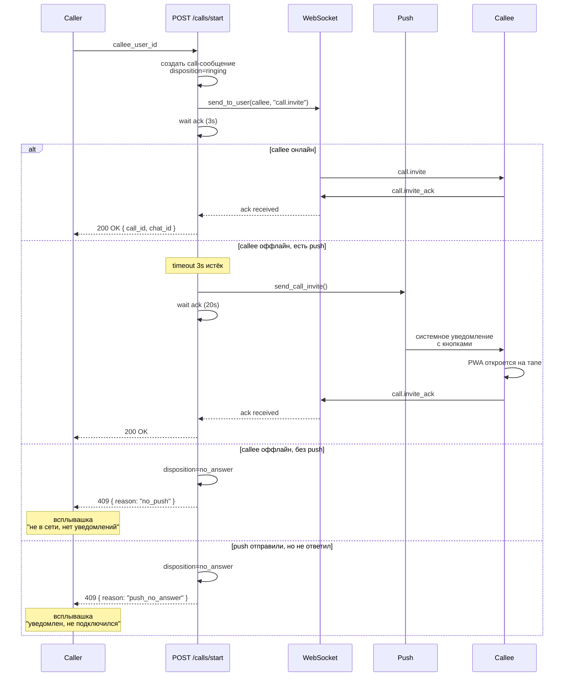

# Звонки <span class="tag tag-new">NEW</span>

WebRTC-звонки 1-на-1 между пользователями FARA. Сигналинг через существующий WebSocket чата, голосовой трафик — peer-to-peer через WebRTC. Если получатель не в сети, бэкенд пробует разбудить его через web push, а если и push не настроен — пишет о пропущенном звонке в чат.

## Концепция

Звонок — это `ChatMessage(message_type='call')` в direct-чате между двумя юзерами. Поля состояния (`call_direction`, `call_disposition`, `call_duration`, ...) задаются миксином `ChatMessagePhoneMixin` из модуля `chat_phone`.

Этот подход даёт сразу несколько вещей бесплатно:

- История звонков уже хранится — это просто чат-сообщения.
- Пропущенные звонки видны в чате как обычные пропущенные.
- Уведомления о звонках идут через тот же механизм, что и о сообщениях.
- Не нужны отдельные таблицы / модели / роутеры.

## Жизненный цикл



## Endpoints

<div class="endpoint endpoint-post" markdown>
<div class="endpoint-head" markdown>
<span class="method-post">POST</span>
`/calls/start`
<span class="endpoint-summary">Начать звонок</span>
</div>
<div class="endpoint-body" markdown>
**Body:** `{ "callee_user_id": int }`

**Response 200:**
```json
{
  "call_id": 123,
  "chat_id": 17,
  "callee": { "id": 42, "name": "Иван" }
}
```

**Response 409 (callee недоступен):**
```json
{
  "detail": {
    "reason": "no_push" | "push_no_answer",
    "message": "Callee is offline...",
    "call_id": 123,
    "chat_id": 17
  }
}
```

См. [Поток вызова](#поток-вызова) для деталей trade-off между WS / push.
</div>
</div>

<div class="endpoint endpoint-post" markdown>
<div class="endpoint-head" markdown>
<span class="method-post">POST</span>
`/calls/{call_id}/accept`
<span class="endpoint-summary">Принять звонок (callee)</span>
</div>
<div class="endpoint-body" markdown>
Только callee может принять (не автор call-сообщения).

Меняет `disposition='answered'`, шлёт `call.accepted` через WS звонящему.
</div>
</div>

<div class="endpoint endpoint-post" markdown>
<div class="endpoint-head" markdown>
<span class="method-post">POST</span>
`/calls/{call_id}/reject`
<span class="endpoint-summary">Отклонить или отменить</span>
</div>
<div class="endpoint-body" markdown>
- если reject делает callee → `disposition='no_answer'`
- если reject делает caller → `disposition='cancelled'`

В обоих случаях — `call.rejected` через WS другой стороне с `reason: "declined" | "cancelled"`.
</div>
</div>

<div class="endpoint endpoint-post" markdown>
<div class="endpoint-head" markdown>
<span class="method-post">POST</span>
`/calls/{call_id}/end`
<span class="endpoint-summary">Завершить активный звонок</span>
</div>
<div class="endpoint-body" markdown>
**Body:** `{ "duration_seconds": int? }`

Считает `call_duration` и `call_talk_duration`. Если клиент прислал свою длительность — уважает её (точнее серверной).
</div>
</div>

<div class="endpoint endpoint-get" markdown>
<div class="endpoint-head" markdown>
<span class="method-get">GET</span>
`/users/{user_id}/availability`
<span class="endpoint-summary">Узнать доступность</span>
</div>
<div class="endpoint-body" markdown>
**Response:** `{ "online": bool, "has_push": bool }`

Используется фронтом для отрисовки индикатора рядом с кнопкой «Позвонить»:

| online | has_push | UI |
|--------|----------|-----|
| ✓ | — | 🟢 Зелёная кнопка, звонок дойдёт мгновенно |
| — | ✓ | 🟡 Жёлтая, "Через push (до 20 сек)" |
| — | — | ⚪ Серая, "Сообщение в чат — он офлайн" |
</div>
</div>

## Поток вызова



## Push wake-up

Если первый таймаут истёк, и у callee есть активная подписка на web push (`Contact(contact_type=web_push)`), бэкенд через `WebPushStrategy.send_call_invite()` шлёт push с payload:

```json
{
  "kind": "call",
  "call_id": 123,
  "chat_id": 17,
  "caller": { "id": 42, "name": "Иван" },
  "tag": "call-123",
  "requireInteraction": true,
  "title": "Иван",
  "body": "Иван звонит…"
}
```

Service Worker на стороне callee видит `kind="call"` и показывает уведомление с кнопками «Принять / Отклонить» и вибрацией. На тап — открывает PWA с URL `?call_id=...&chat_id=...&auto=accept|reject`.

`NotificationBridge` на фронте парсит эти параметры и автоматически вызывает `acceptCall()` / `rejectCall()` как только в WS придёт `call.invite`.

!!! info "Web Push не звонит сам"
    SW не может проиграть звук без открытого окна — это политика всех браузеров. Уведомление + системный звук + вибрация — максимум, что доступно из самого пуша.

    Для «настоящего» VoIP-звонка с заблокированного экрана нужен нативный мобильный канал (FCM с категорией VoIP / APNS PushKit). PWA до этого не дотягивается. Если потребуется — оборачивать через Capacitor с CallKit.

## Pending invite — атомарный ack

Перед отправкой WS-инвайта, бэкенд регистрирует `asyncio.Event` в `chat_manager._pending_invites[call_id]`:

```python
ack_event = chat_manager._register_pending_invite(msg.id)

await chat_manager.send_to_user(callee_id, {
    "type": "call.invite",
    "call_id": msg.id,
    ...
})

try:
    await asyncio.wait_for(ack_event.wait(), timeout=_INVITE_ACK_TIMEOUT)
finally:
    chat_manager._cleanup_pending_invite(msg.id)
```

Когда callee получает invite, он шлёт `call.invite_ack` обратно. Хендлер этого сообщения:

```python
if message["type"] == "call.invite_ack":
    chat_manager._resolve_pending_invite(message["call_id"])
```

`_resolve_pending_invite` ставит соответствующий `Event`. Бэкенд просыпается из `wait_for` и продолжает.

Cross-process работает корректно: в pubsub летит и invite, и ack — оба воркера видят, какой `call_id` подтверждён.

## Сериализация call-сообщения

`_serialize_call_message()` приводит ChatMessage к формату, который фронт использует для обычных сообщений. Поля `call_*` встраиваются прямо в payload:

```json
{
  "id": 123,
  "message_type": "call",
  "author": { "id": 42, "name": "Иван", "type": "user" },
  "create_datetime": "2026-04-30T12:34:56Z",
  "call_direction": "outgoing",
  "call_disposition": "answered",
  "call_duration": 67,
  "call_talk_duration": 60,
  "call_answer_time": "2026-04-30T12:35:03Z",
  "call_end_time": "2026-04-30T12:36:03Z"
}
```

Так фронту не нужно делать отдельный запрос за деталями звонка — он рисует плашку прямо из ленты сообщений через `CallMessageContent`.

## WebRTC

Сам голосовой трафик идёт **peer-to-peer** через `RTCPeerConnection`, а там, где p2p не собирается — через релей (TURN).

SDP offer/answer и ICE candidates ходят через тот же WebSocket чата как сообщения типа `webrtc.offer`, `webrtc.answer`, `webrtc.ice`. Бэкенд их просто пробрасывает через `send_to_user` — никакой логики, кроме маршрутизации, на сервере нет.

## ICE / TURN

Список ICE-серверов **не хардкодится на фронте**. Он общий на все звонки — и на внутренние WebRTC, и на звонилку к АТС (`fara_sip_phone`) — и приходит с бэкенда:

<div class="endpoint endpoint-get" markdown>
<div class="endpoint-head" markdown>
<span class="method-get">GET</span>
`/ice/servers`
<span class="endpoint-summary">ICE-серверы для текущего пользователя</span>
</div>
</div>

```json
{
  "data": {
    "ice_servers": [
      { "urls": ["stun:crm.example.com:3478"] },
      {
        "urls": ["turn:crm.example.com:3478?transport=udp",
                 "turn:crm.example.com:3478?transport=tcp"],
        "username": "1790000000:42",
        "credential": "0Yt3…="
      },
      { "urls": ["stun:stun.l.google.com:19302"] }
    ],
    "ice_transport_policy": "all",
    "ttl": 3600
  }
}
```

Креды **временные** (TURN REST API, RFC 7635): `username = "<unixtime истечения>:<user_id>"`, пароль — `base64(HMAC-SHA1(secret, username))`. Релей знает только общий секрет, поэтому заводить и синхронизировать на нём пользователей не нужно. Фронт перезапрашивает креды по `ttl` (хук `useIceConfig`, `services/api/ice.ts`).

`POST /ice/test` (только администратор) делает настоящую аллокацию теми же кредами и отвечает, работает ли релей (`{ ok, error, mapped_address, relayed_address }`). В интерфейсе это кнопка «Проверить релей» в блоке действий телефонного коннектора. Проверка идёт **с сервера CRM**: положительный ответ доказывает, что релей жив и секрет совпадает, но не проверяет путь конкретного клиента; в облаке с 1:1 NAT она может дать ложноотрицательный результат.

### Где что настраивается

| Что | Где | Когда применяется |
|---|---|---|
| `enabled` (по умолчанию **включён**), `host` (по умолчанию — домен из `site_url`), `port`, `tls_port`, `ttl`, `force_relay`, `fallback_stun` | «Системные настройки», ключи `turn.*` (модуль `turn`); `.env` — дефолт | со следующего звонка, без перезапуска |
| секрет | генерируется бэкендом при первом старте в общий том `turn_secret` | ротация = удалить файл + `docker compose restart backend turn` |
| порты релея, `denied-peer-ip`, квоты, TLS | `docker/turnserver.conf` | `docker compose restart turn` |

Пустое значение настройки в интерфейсе означает «взять из `.env`» — уже настроенные стенды не меняют поведения. Значения читаются в момент запроса `/ice/servers` одним запросом и **без кеша**: кеш `system_settings` живёт в процессе, а воркеров несколько, и закешированная настройка расходилась бы между ними до перезапуска.

### Релей в поставке

coturn поднимается вместе с остальными сервисами обычным `docker compose up -d` — отдельного профиля больше нет. Настраивать нечего: секрет генерируется при первом старте, а адрес релея берётся из `site_url` (релей стоит на той же машине, что и CRM). Ручных шагов ровно два, и оба про сеть:

```bash
sudo ufw allow 3478/udp && sudo ufw allow 3478/tcp
sudo ufw allow 49160:49660/udp
```

Переопределять в `.env` нужно только исключения:

```ini
# релей на отдельной машине (иначе берётся домен из site_url)
TURN__HOST="turn.example.com"
# облако с 1:1 NAT — иначе релей раздаёт адрес, которого снаружи нет
TURN_EXTRA_ARGS=--external-ip=203.0.113.10
# выключить релей совсем
TURN__ENABLED=false
```

!!! warning "Имена переменных — ЗАГЛАВНЫМИ"
    Эти строки читает и бэкенд, и docker compose. Бэкенду регистр безразличен, а compose ищет точное совпадение имени: строчный `turn__realm` он не увидит.

Секрет передаётся не переменной окружения, а **файлом в общем томе**: compose подставляет переменные при создании контейнера, поэтому любая правка требовала бы пересоздавать оба сервиса, а опечатка в регистре давала бы молча пустой секрет и релей, отвергающий все звонки. Бэкенд создаёт файл атомарно (`O_EXCL`) — два воркера не могут записать разные секреты; контейнер релея ждёт появления файла в своём entrypoint.

Конфигурация самого coturn — `docker/turnserver.conf`. Что важно знать:

- **Диапазон релей-портов** 49160–49660. Считать надо по аллокациям, а не по звонкам: браузер берёт отдельную аллокацию на КАЖДЫЙ `turn:`-URL (udp, tcp, tls — три разных), то есть один участник занимает до трёх портов. Публиковать широкий диапазон через докер нельзя — на каждый порт поднимается свой `docker-proxy`, поэтому `network_mode: host`. Порты нужно открыть в ufw вручную: host-сеть правила фаервола не обходит.
- **Приватные сети запрещены** (`denied-peer-ip`, включая записи вида `::ffff:10.0.0.0` — IPv4-mapped IPv6 иначе даёт обходной путь). Без этого любой обладатель кредов дотянулся бы через релей до postgres и соседей по докер-сети. Если АТС стоит в приватной сети, её адрес возвращают через `--allowed-peer-ip=…` в `TURN_EXTRA_ARGS`.
- **`no-tcp-relay`** — релей чужого TCP (RFC 6062) выключен: WebRTC он не нужен, а без него сервер CRM становится открытым TCP-прокси для любого сотрудника с кредами. TURN поверх TCP (транспорт до релея) при этом работает.
- **В облаке с 1:1 NAT** (AWS, Yandex Cloud) нужен `--external-ip=<белый IP>` — иначе релей раздаёт клиентам адрес, которого снаружи нет.
- **Квоты** `user-quota`/`total-quota` — это число одновременных аллокаций, а не мегабиты; полоса не ограничивается.
- **TLS (`turns:`)** требует не только сертификата, но и прав на него: certbot кладёт `privkey.pem` с правами `0600 root`, а релей работает не от root. Нужен deploy-hook, копирующий пару в читаемую папку после каждого продления, и `docker compose restart turn` — сертификат перечитывается только при старте. Пошагово — в разделе TLS в `docker/turnserver.conf`. TCP на 3478 работает и без TLS, этого хватает большинству сетей с закрытым UDP.

!!! tip "Без релея тоже работает"
    `TURN__ENABLED=false` — отдаётся только STUN из `fallback_stun`. Звонки в дружественных сетях идут как раньше, в строгих — не соединятся. Запасные STUN отдаются и при включённом релее: если контейнер релея упадёт, p2p продолжит собираться.

## Состояния звонка на фронте

```typescript
type CallState =
  | 'idle'        // нет активного звонка
  | 'calling'     // исходящий, ждём ack/accept
  | 'incoming'    // входящий, показываем UI
  | 'connecting'  // accepted, идёт SDP/ICE
  | 'active'      // разговор
  | 'ended';      // завершён, показываем итог
```

Хук `useWebRTCCall()` экспортирует `state`, `session`, `endReason`, плюс действия: `startCall`, `acceptCall`, `rejectCall`, `hangup`, `toggleMute`. Глобально подключается через `<CallProvider>` в корне приложения.

`<CallWidget />` рендерит UI всех фаз — плашка в правом нижнем углу. При `incoming` играет рингтон через Web Audio API (генерирует тон, не нужен mp3).

## Известные ограничения

- **Один звонок за раз** на пользователя — кнопка `<CallButton>` блокируется при `state != 'idle'`.
- **Только аудио** — видео не реализовано.
- **Group call отсутствует** — только 1-на-1 в `direct`-чате.
- **Запись** — нет (можно добавить через `MediaRecorder` API при необходимости).

## См. также

- [Чат — архитектура](chat-architecture.md) — WebSocket, pub/sub
- [Push wake-up на бэкенде](../system/cron.md) — общий механизм cron
