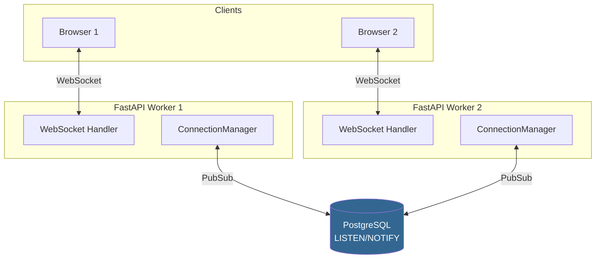

# Chat Module

Real-time чат с WebSocket, PubSub и интеграцией с внешними мессенджерами.

## Архитектура



!!! info "Cross-process messaging"
    Сообщения проходят через PostgreSQL `LISTEN/NOTIFY` (или Redis Pub/Sub) — это гарантирует доставку между всеми worker-процессами.

## Типы чатов

| Тип | Описание | Права по умолчанию |
|-----|----------|-------------------|
| `direct` | Личный чат 1-на-1 | Чтение, запись, pin |
| `group` | Групповой чат | Чтение, запись |
| `channel` | Канал (только админы пишут) | Только чтение |
| `record` | Чат привязанный к записи CRM | Чтение, запись |

## API — Messages

### Отправка сообщения

<span class="method-post">POST</span> `/chats/{chat_id}/messages`

```json
{
    "body": "Hello, World!",
    "attachments": [],
    "parent_id": null,
    "connector_id": null
}
```

Сообщение сохраняет и рассылает `ChatMessage.send`. С `connector_id` оно уходит ещё и во внешний канал — после коммита, чтобы запрос к провайдеру не держал транзакцию. Не ушло (коннектор выключен, нет адресата, ошибка провайдера) — сообщение остаётся в ленте с `send_failed = true`, и рядом со временем показывается красная пометка «Не доставлено во внешний канал».

### Получение сообщений

<span class="method-get">GET</span> `/chats/{chat_id}/messages?limit=50&before_id=100`

Пагинация курсором: `before_id` — загрузить сообщения старше указанного ID.

### Редактирование

<span class="method-patch">PATCH</span> `/chats/{chat_id}/messages/{message_id}`

```json
{
    "body": "Edited message text"
}
```

### Удаление

<span class="method-delete">DELETE</span> `/chats/{chat_id}/messages/{message_id}`

Soft delete — `is_deleted = true`.

### Pin / Unpin

<span class="method-post">POST</span> `/chats/{chat_id}/messages/{message_id}/pin`

```json
{"pinned": true}
```

### Реакции

<span class="method-post">POST</span> `/chats/{chat_id}/messages/{message_id}/reactions`

```json
{"emoji": "👍"}
```

Повторный вызов с тем же emoji — toggle (убирает реакцию).

## WebSocket Events

Клиент подключается к `/ws/chat` и получает события. Вход — как у HTTP-ручек: токен в адресе плюс HttpOnly cookie сессии (браузер шлёт её сам), сессия не должна быть просрочена. Отказ — закрытие с кодом `1008`.

```typescript
// Подключение
const ws = new WebSocket(`wss://api.fara.dev/ws/chat?token=${token}`);

ws.onmessage = (event) => {
    const data = JSON.parse(event.data);

    switch (data.type) {
        case "new_message":
            // Новое сообщение
            addMessage(data.chat_id, data.message);
            break;

        case "message_edited":
            updateMessage(data.message_id, data.body);
            break;

        case "message_deleted":
            removeMessage(data.message_id);
            break;

        case "message_pinned":
            togglePin(data.message_id, data.pinned);
            break;

        case "reaction_update":
            updateReaction(data.message_id, data.reactions);
            break;
    }
};
```

## PubSub — Strategy Pattern

Шина событий между воркерами — отдельный системный модуль `bus` (`backend/base/system/bus`): чат подписывается на свои типы событий (`PubSubCommand`) и публикует через `env.apps.bus`. Бэкенд выбирается через `.env`:

=== "PostgreSQL (по умолчанию)"

    ```bash title=".env"
    bus__backend=pg
    ```

    Использует `LISTEN/NOTIFY`. Просто, без доп. инфраструктуры.

=== "Redis"

    ```bash title=".env"
    bus__backend=redis
    bus__redis_url=redis://localhost:6379/0
    ```

    Выше throughput, не занимает соединение из asyncpg pool.

Переключение backend'а не требует изменения кода — Strategy pattern:

```python title="backend/base/system/bus/pubsub/"
# pubsub/
# ├── __init__.py      # create_pubsub_backend() factory
# ├── base.py          # PubSubBackend (abstract)
# ├── pg_backend.py    # PostgreSQL LISTEN/NOTIFY
# └── redis_backend.py # Redis Pub/Sub
```

## Модели

### Chat

```python
class Chat(DotModel):
    __table__ = "chats"

    name: str = Char(max_length=255, required=True)
    chat_type: str = Selection(
        options=[
            ("direct", "Личный"), ("group", "Группа"),
            ("channel", "Канал"), ("record", "Чат записи"),
        ],
        default="group",
    )
    creator_id: "User" = Many2one["User"](relation_table="users")
    is_archived: bool = Boolean(default=False)
```

### ChatMember

```python
class ChatMember(DotModel):
    __table__ = "chat_members"

    chat_id: "Chat" = Many2one["Chat"](relation_table="chats", required=True)
    user_id: "User" = Many2one["User"](relation_table="users", required=True)
    is_active: bool = Boolean(default=True)
    is_admin: bool = Boolean(default=False)
    can_read: bool = Boolean(default=True)
    can_write: bool = Boolean(default=True)
    can_invite: bool = Boolean(default=False)
    can_remove: bool = Boolean(default=False)
    can_pin: bool = Boolean(default=False)
    can_delete_others: bool = Boolean(default=False)
```

### Права участника

| Право | Что даёт |
|-------|----------|
| `can_read` / `can_write` | читать и писать сообщения |
| `can_invite` | добавлять участников |
| `can_remove` | удалять участников |
| `can_pin` | закреплять сообщения |
| `can_delete_others` | удалять чужие сообщения |
| `is_admin` | всё перечисленное плюс права участников, права по умолчанию, удаление чата |

Набор прав — класс, а не словарь. Общие права участника любого контейнера (чат, проект) — `MemberPermissions` в `backend/base/system/membership`, права чата — `ChatPermissions` рядом с `ChatMember`. По умолчанию набор пуст, включённые права перечисляют явно:

```python
@dataclass(frozen=True)
class ChatPermissions(MemberPermissions):  # can_read, can_write, can_invite,
    can_pin: bool = False                  # can_remove, is_admin
    can_delete_others: bool = False

# участник группы, чата клиента, заметок
MEMBER = ChatPermissions(can_read=True, can_write=True)
# оба в личном чате
DIRECT = ChatPermissions(can_read=True, can_write=True, can_pin=True)
ADMIN = ChatPermissions(can_read=True, can_write=True, can_invite=True,
                        can_remove=True, can_pin=True,
                        can_delete_others=True, is_admin=True)

await ChatMember.add(chat_id, MEMBER, user_id=user_id)
await ChatMember.add(chat_id, chat.get_default_permissions(), partner_id=partner_id)
```

Состав ведёт миксин `MemberMixin`: `add`, `remove`, `active_user_ids`, `count_admins`.

### Проверка прав

Права проверяет один метод — `MemberMixin.check_permissions`. Ему передают уже найденного участника (в базу он не ходит) и, если действие доступно не только админам, нужные права — тем же классом, без строк с именами:

```python
member = await ChatMember.get_membership(chat_id, user_id)    # None, если не участник
ChatMember.check_permissions(member)                # только админы, иначе 403
# админы или участник с правом приглашать
ChatMember.check_permissions(member, ChatPermissions(can_invite=True))
```

Порядок проверки:

1. системный админ (`Session.is_system_admin` — суперпользователь или роль `system_admin`, сессия берётся из `get_access_session()`) проходит всегда, даже не будучи участником;
2. остальным нужно членство;
3. админ чата (`is_admin`) проходит;
4. участник проходит, если у него включено каждое право из переданного набора;
5. иначе — `PERMISSION_DENIED` (403).

Писать и закреплять сообщения может только участник чата, поэтому в этих ручках его берут через `check_membership` — не участнику 403 ещё до проверки права, даже системному админу:

```python
member = await ChatMember.check_membership(chat_id, user_id)  # не участник — 403
ChatMember.check_permissions(member, ChatPermissions(can_write=True))
```

### Доступ

- **Читают** чат его участники, команда чата (`chat.team_id`) и суперпользователь — это правила доступа модели `chat`, ручки ленты, поиска и пересылки зовут `Chat.check_read_access`. Остальным — 403.
- **Пишут** участники с `can_write`.
- **Сообщение правят, удаляют и закрепляют только в его чате**: права проверяются в чате из адреса, поэтому сообщение другого чата по этому адресу — 404.
- **Заметки записи** (record-чат) открывает тот, кто видит саму запись — проверяют правила доступа её модели.
- **Коннекторы** и их служебные таблицы (`chat_external_*`, правила маршрутизации) сотрудник только читает. Настраивает их администратор настроек — суперпользователь или роль `system_admin` (`Session.is_system_admin`): и записи, и ручки `/connectors/{id}/...` (вебхук, проверка соединения, импорт истории; `Session.check_system_admin`). Сервер пишет в них под `sudo`: входящий вебхук и внешняя отправка.

### Администратор чата

`ChatMember.is_admin` даёт все права в чате: добавлять и удалять участников, менять их права и права чата по умолчанию, удалять чат. Добавлять и удалять участников могут и не админы — с правами `can_invite` и `can_remove`. Правил два, оба считают админов чата (`ChatMember.count_admins`):

1. **В группе без админа добавляемый пользователь становится админом** (`Chat._add_user_member`). Группу из «Нового чата» создаёт пользователь — админ он. Чат клиента создаёт система (`Chat.get_or_create_partner_chat`), поэтому админ там — первый пользователь: руководитель коннектора, а без руководителей — взявший лид или нажавший «Создать чат» в карточке партнёра.
2. **Последний админ не выходит из чата, не снимает с себя права и не может быть удалён** (`ChatMember.check_not_last_admin`) — ошибка `CANNOT_REMOVE_THE_LAST_CHAT_ADMIN`, «сначала передайте права администратора другому участнику». Единственному участнику остаётся удалить чат или добавить коллегу и передать права ему.

В личных и record-чатах админа нет — участниками там не управляют; в личный чат участника не добавить, для разговора втроём создают группу.

Добавленный участник получает права чата по умолчанию (`default_can_*`), их меняет админ во вкладке «Права» настроек чата.

**Администратор системы** — суперпользователь или роль `system_admin` — управляет группой наравне с её админом: название, участники и их права, права по умолчанию, удаление чата. Суперпользователь — любой группой, в том числе той, где не состоит (такие чаты в списке открывает опция «Показывать чужие чаты»). На роль действуют правила доступа к строкам: чужую группу она не видит, а в группе, которую читает по команде, сначала добавляет себя участником. Так админ появляется в группе, оставшейся без него (созданной до правила 1): администратор системы назначает его в настройках чата или добавляет участника — тот становится админом по правилу 1. На сообщения правило не распространяется: писать, править и закреплять можно только по своим правам участника.
