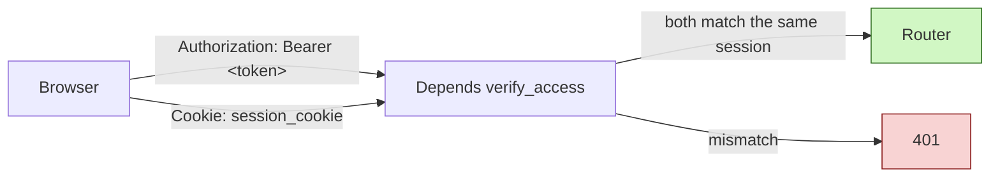
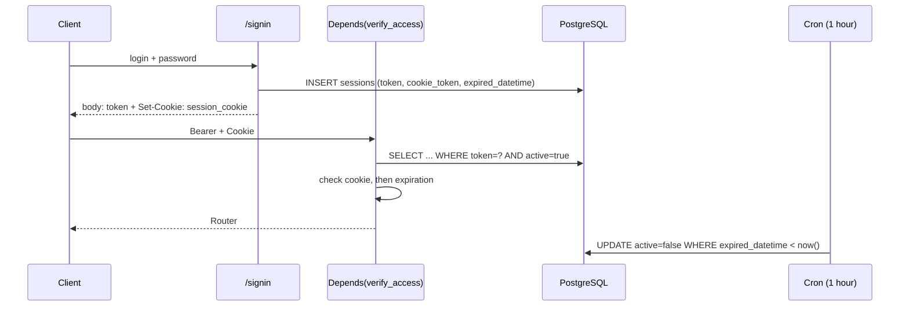
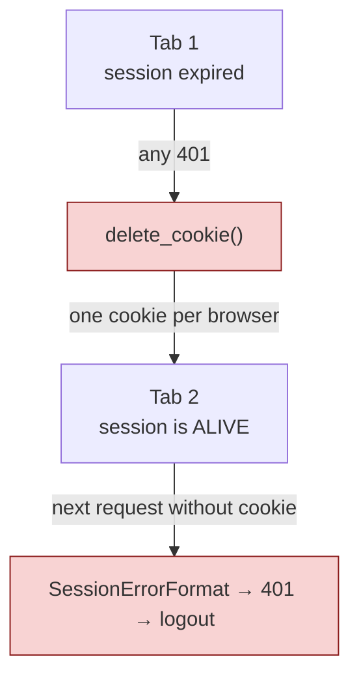

# Authentication and sessions

A FARA session is protected by **two** secrets at once: the Bearer token goes to the client in the login response body, the guard cookie — in `Set-Cookie` with the `HttpOnly` flag. A request passes only if both point to the same row in the `sessions` table.

## Why two tokens

The Bearer token lives in `localStorage` — any XSS can read it. The guard cookie is marked `HttpOnly` and cannot be read from JavaScript at all. So a stolen Bearer is useless on its own: without the cookie, `verify_access` won't let it through. This is **Token Binding** — binding the token to the browser.

| Secret | Where it is stored | Who can read it | Field in `sessions` |
|--------|--------------------|-----------------|---------------------|
| Bearer token | `localStorage['session']` on the client | Page JS, therefore XSS too | `token` |
| Guard cookie | Browser cookie jar, `HttpOnly` | Only the browser, which sends it itself | `cookie_token` |



Both secrets are generated at login in `backend/base/crm/users/routers/users.py`:

```python
token = secrets.token_urlsafe(nbytes=64)
cookie_token = secrets.token_urlsafe(nbytes=64)
```

In the `/signin` response the cookie is set separately, while `cookie_token` is **excluded** from the body — otherwise `HttpOnly` would be pointless:

```python title="backend/base/crm/users/routers/users.py"
response.set_cookie(
    key=env.settings.auth.cookie_name,
    value=cookie_token,
    httponly=True,
    secure=env.settings.auth.cookie_secure,
    samesite=env.settings.auth.cookie_samesite,
    max_age=ttl,
    path="/",
)
result = session.json(exclude={"cookie_token"}, mode=JsonMode.FORM)
```

Cookie parameters live in `backend/base/crm/auth_token/settings.py` and are overridden through env (`AUTH__COOKIE_SECURE`, `AUTH__COOKIE_NAME`, `AUTH__COOKIE_SAMESITE`):

```python
cookie_secure: bool = False
cookie_name: str = "session_cookie"
cookie_samesite: Literal["lax", "strict", "none"] | None = "lax"
```

In production (`docker-compose.yml`) `AUTH__COOKIE_SECURE: true`; in dev those lines are commented out, so the cookie travels over plain HTTP as well.

## The Session model

`backend/base/crm/security/models/sessions.py`, table `sessions`.

<div class="field" markdown>
`token` <span class="field-type">Char(256)</span> <span class="field-flag">index</span>

The Bearer token. `session_check` looks up the session by it.
</div>

<div class="field" markdown>
`cookie_token` <span class="field-type">Char(256)</span> <span class="field-flag">index</span>

The guard cookie value. Compared against the incoming cookie on every request; for binary-content routes it is also used for the reverse lookup of the session.
</div>

<div class="field" markdown>
`ttl` <span class="field-type">Integer</span>

Lifetime in seconds, taken from the setting at login time. Stored on the row for history — it does not affect expiration checks, only `expired_datetime` is checked.
</div>

<div class="field" markdown>
`expired_datetime` <span class="field-type">Datetime</span>

The moment the session dies. Written **once** at login as `now + ttl` and never moved afterwards.
</div>

<div class="field" markdown>
`active` <span class="field-type">Boolean</span> <span class="field-flag">default=True</span>

The revocation flag. Cleared by logout, `terminate_sessions`, the active-session limit, the hourly cron, and by the check itself when it finds an elapsed `expired_datetime` (lazy deactivation). Every check looks for a session with `active = true`.
</div>

!!! warning "`last_activity` does not work"
    The field is declared with a comment saying it is "updated via WS ping", but there is not a single write or read of it in the whole repository. It is always `NULL`, so it cannot be used to tell whether a user is online.

### TTL

`Session.get_ttl()` reads the `auth.session_ttl` setting from `system_settings` and falls back to `DEFAULT_TTL` (1 day) on any error. The actual default of the setting is declared in `backend/base/crm/security/app.py` and equals **7 days**:

```python
{
    "key": "auth.session_ttl",
    "value": {"value": 60 * 60 * 24 * 7},
    ...
}
```

So `DEFAULT_TTL = 60 * 60 * 24 * 1` is an emergency fallback, not the working value.

## Lifecycle



### Creation

`/signin` finds the user, verifies the password hash, generates the token pair, writes the session with `expired_datetime = now + ttl` and sets the cookie. Then `enforce_session_limit(user_id)` deactivates the oldest sessions in a single CTE query if the number of active ones exceeds `auth.max_active_sessions` (50 by default, batch of 10).

### Verification

A router is protected by a **FastAPI dependency**, not middleware:

```python
router_private = APIRouter(
    dependencies=[Depends(AuthTokenApp.verify_access)],
)
```

`verify_access` requires **both** secrets: no `Authorization` header — `SessionErrorFormat`; no cookie — `SessionErrorFormat` as well. Then either `session_check` or `session_check_cached` runs, selected by the `AuthTokenApp.session_cache_enabled` flag. The resolved session is put into `request.state.session` and into a ContextVar via `set_access_session(session)` — from that point DotORM sees it when checking ACL and Rules.

### Session cache

The `auth.session_cache_enabled` setting (on by default) switches the checks over to `SessionCache` — an in-memory dictionary per worker with four indexes (`_by_token`, `_by_cookie`, `_by_session_id`, `_by_user_id`).

!!! info "The flag is read once at startup"
    `post_init` stores the value in the class attribute `AuthTokenApp.session_cache_enabled`. Changing the setting in the database is not enough — a restart is required.

The cache lives in worker memory, so revocations are broadcast to the other workers via pg_notify:

| Channel | Who publishes | What the consumer does |
|---------|---------------|------------------------|
| `session_revoked` | logout, cron, session limit, `terminate_sessions` | `cache.revoke(id)` — marks `revoked=True` and clears the indexes |
| `session_roles_changed` | change of `role_ids` / `is_admin` / teams | `cache.invalidate_user(id)` — drops the entry **without** revoking, the next request rebuilds it with fresh roles |

The distinction matters: changing roles must not log the user out, hence a separate channel instead of a revoke.

### Expiration

Expiration is checked lazily, on request: if `expired_datetime < now`, the session is deactivated right away with `UPDATE ... active = false` and `SessionExpired` is raised. In parallel, the hourly cron job `Auth: deactivate expired sessions` sweeps up sessions nobody came back to:

```python
result = await env.models.session.cron_expire_sessions()
```

### Termination

`POST /sessions/logout` deactivates the current session, publishes `session_revoked` and deletes the cookie. `POST /sessions/terminate_all` has two modes: `MY` — all sessions of the current user except the current one; `ALL` — every active session in the system except the current one. Changing the password closes all sessions except the one it was changed from.

## The guard cookie and 401 handling

This is the place where it is easy to make things worse. The key fact:

!!! warning "There is ONE cookie per browser"
    `session_cookie` is shared across all tabs and all sessions of that browser. `delete_cookie` hits every tab at once.

Previously the 401 handler called `response.delete_cookie()` on **any** `AuthFailed`. The consequence: a single stale tab left open overnight would make a request, get a 401 — and take the cookie away from live sessions in the other tabs. On their very next request those got `SessionErrorFormat` (no cookie) → 401 → logout. A cascading logout with no real cause behind it.



### The `AuthFailed.clear_cookie` flag

The fix moves the decision to the raise site, where the context is known:

```python title="backend/base/system/auth/exception.py"
class AuthFailed(Exception):
    def __init__(self, *args, clear_cookie: bool = False) -> None:
        super().__init__(*args)
        self.clear_cookie = clear_cookie
```

The handler became conditional:

```python title="backend/base/crm/auth_token/app.py"
if exc.clear_cookie:
    response.delete_cookie(
        key=env.settings.auth.cookie_name,
        httponly=True,
        path="/",
        secure=env.settings.auth.cookie_secure,
        samesite=env.settings.auth.cookie_samesite,
    )
```

### Order of checks in `session_check`

To make the flag meaningful, the Token Binding comparison was moved **above** the expiration check:

```python title="backend/base/crm/security/models/sessions.py"
# Token Binding: cookie_token обязателен. Сверяем ДО проверки срока —
# тогда ниже точно известно, что кука принадлежит этой сессии, и её
# можно удалять вместе с ней.
stored_cookie = session_id.get("cookie_token")
if not stored_cookie or not cookie_token or cookie_token != stored_cookie:
    raise AuthException.SessionNotExist()

expired = session_id["expired_datetime"]
if expired < now:
    ...
    raise AuthException.SessionExpired(clear_cookie=True)
```

The logic reads top to bottom: if execution reached the expiration branch, the cookie has already been compared and provably belongs to **this** session — only then is deleting it legitimate.

### Behaviour matrix

| Situation | Where | Cookie |
|-----------|-------|--------|
| Bearer not found or session inactive (cookie not compared yet) | `session_check`, `session_check_cached` | — |
| Cookie did not match the session | `session_check`, `session_check_cached` | — |
| No `Authorization` header or no cookie (`SessionErrorFormat`) | `verify_access`, `verify_access_by_cookie` | — |
| Cookie compared, session expired | `session_check`, `session_check_cached` | ✓ delete |
| Cookie compared, cache entry revoked | `session_check_cached` | ✓ delete |
| Session found **by the cookie itself**, expired | `session_check_by_cookie`, `session_check_by_cookie_cached` | ✓ delete |
| Session found **by the cookie itself**, cache entry revoked | `session_check_by_cookie_cached` | ✓ delete |
| Nothing found by the cookie | `session_check_by_cookie`, `session_check_by_cookie_cached` | — |

The `revoked` branch exists only in the cached versions. In the database a revoked session is `active = false`, so it never enters the result set (`AND s.active = true`) and yields "not found" — the first row of the table: the cookie is left alone.

The last row is the non-obvious one. An orphan cookie points at no session, so deleting it looks harmless. But `delete_cookie` deletes by **name**, not by value: while the request was in flight, a login could have happened in another tab, and a fresh working cookie now sits under the same name. Deleting it would log out the user who just signed in.

!!! warning "Rule for new AuthFailed raise sites"
    By default do **not** set `clear_cookie`. Set `clear_cookie=True` only where it is proven, at that very point, that the cookie belongs to the session that is dying right now: either it has already been compared against `cookie_token` earlier in the code, or the session was found by looking it up by that cookie. In every other case — "not found", "did not match", "malformed" — leave the cookie alone: it may belong to a live session in another tab.

## Router authorization schemes

| Dependency | What it requires | Where it is used |
|------------|------------------|------------------|
| `verify_access` | Bearer + cookie | Every `router_private` — the main mode |
| `verify_access_by_cookie` | Cookie only | `router_content` in `backend/base/crm/attachments/routers/attachments.py` — serving files and previews |
| `use_system_session` | Nothing, grants full access | `/signin`, webhooks, OAuth callbacks |
| `use_anonymous_session([...])` | Nothing, READ over a table whitelist | WebSocket routes, public icons |

!!! info "Why content needs its own scheme"
    ``, `<a href>`, `<audio src>` and `window.open()` cannot carry an `Authorization` header — the browser only sends the cookie. That is why attachments have a pair of routes authorized by a reverse session lookup on `cookie_token`.

## Known limitations

The `clear_cookie` change closed the cascade, but the neighbouring causes of unexpected logouts are still there. Below is what has **not** been done, so it does not have to be rediscovered on the next bug report.

### The delete-by-name race

The window narrowed from "any 401" down to "an expired session with a compared cookie exactly at the moment of a login", but not to zero. `delete_cookie` matches the cookie name and ignores its value. If a login in another tab happens between the stale tab sending its request and receiving the response, the fresh cookie will still be wiped. A complete fix would require matching the value on the browser side, which HTTP cannot do.

### Sessions are never extended

`expired_datetime` is written once at login. User activity does not affect it — neither REST requests nor WebSocket traffic. After 7 days the session dies mid-work, and there is no refresh mechanism.

!!! info "`baseQueryWithReauth` does no reauth"
    The file name `frontend/src/services/baseQueryWithReauth.ts` promises more than it delivers: there is no token refresh and no request retry in it, a 401 leads straight to logout.

### Tabs are not synchronized

The frontend `authSlice` has no `storage` listener, so a login or logout in one tab never reaches the others — they find out only on their own next 401.

A module-level flag in `frontend/src/services/baseQueryWithReauth.ts` adds to the picture:

```typescript
let isRedirecting = false;
```

It is set to `true` on the first 401 and **never reset back**. Over the lifetime of a tab, the 401-driven logout fires exactly once.

## See also

- [Security Module](../modules/security.md) — ACL through ContextVar, `SystemSession`, wiring the dependencies.
- [Roles and rules](roles-and-rules.md) — what happens to a request once the session has been resolved.
- [User hierarchy](hierarchy.md) — system users and role inheritance.
- [Cron — task scheduler](../system/cron.md) — the `Auth: deactivate expired sessions` job.
- [Security tests](../testing/security.md) — expiration and session-hijacking checks.
