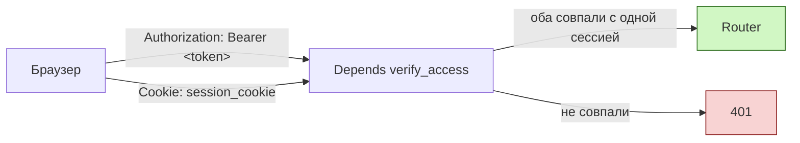
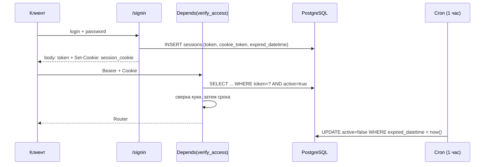
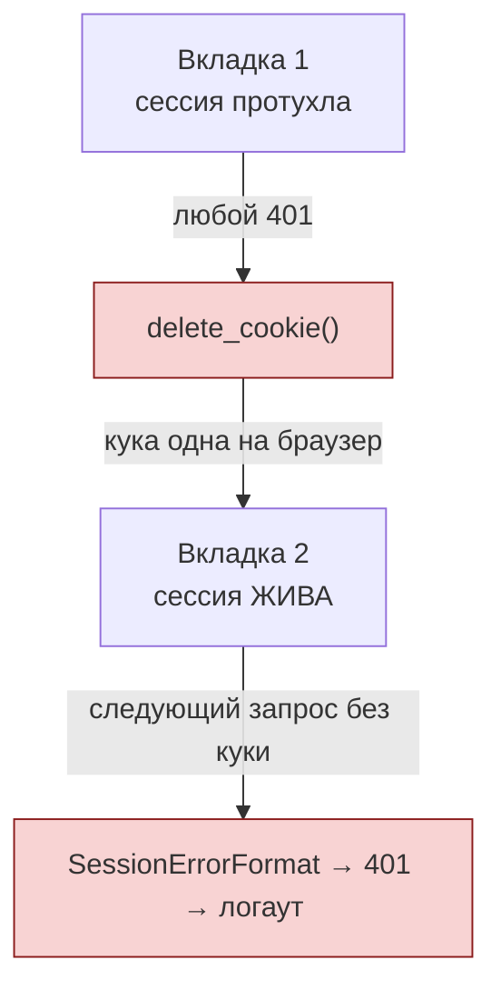

# Аутентификация и сессии

Сессия в FARA защищена **двумя** секретами сразу: Bearer-токен уходит клиенту в теле ответа на логин, guard-кука — в `Set-Cookie` с флагом `HttpOnly`. Запрос проходит, только если оба указывают на одну и ту же строку в таблице `sessions`.

## Зачем два токена

Bearer-токен лежит в `localStorage` — его может прочитать любой XSS. Guard-кука помечена `HttpOnly`, из JavaScript она не читается вообще. Поэтому украденный Bearer сам по себе бесполезен: без куки `verify_access` его не пропустит. Это **Token Binding** — привязка токена к браузеру.

| Секрет | Где хранится | Кто может прочитать | Поле в `sessions` |
|--------|--------------|---------------------|-------------------|
| Bearer-токен | `localStorage['session']` на клиенте | JS страницы, значит и XSS | `token` |
| Guard-кука | Cookie-jar браузера, `HttpOnly` | Только браузер, отправляет сам | `cookie_token` |



Оба секрета генерируются при логине в `backend/base/crm/users/routers/users.py`:

```python
token = secrets.token_urlsafe(nbytes=64)
cookie_token = secrets.token_urlsafe(nbytes=64)
```

В ответ на `/signin` кука ставится отдельно, а `cookie_token` из тела ответа **исключён** — иначе смысл `HttpOnly` пропал бы:

```python title="backend/base/crm/users/routers/users.py"
response.set_cookie(
    key=env.settings.auth.cookie_name,
    value=cookie_token,
    httponly=True,
    secure=env.settings.auth.cookie_secure,
    samesite=env.settings.auth.cookie_samesite,
    max_age=ttl,
    path="/",
)
result = session.json(exclude={"cookie_token"}, mode=JsonMode.FORM)
```

Параметры куки — в `backend/base/crm/auth_token/settings.py`, переопределяются через env (`AUTH__COOKIE_SECURE`, `AUTH__COOKIE_NAME`, `AUTH__COOKIE_SAMESITE`):

```python
cookie_secure: bool = False
cookie_name: str = "session_cookie"
cookie_samesite: Literal["lax", "strict", "none"] | None = "lax"
```

В проде (`docker-compose.yml`) `AUTH__COOKIE_SECURE: true`; в dev эти строки закомментированы, поэтому кука ходит и по HTTP.

## Модель Session

`backend/base/crm/security/models/sessions.py`, таблица `sessions`.

<div class="field" markdown>
`token` <span class="field-type">Char(256)</span> <span class="field-flag">index</span>

Bearer-токен. По нему ищется сессия в `session_check`.
</div>

<div class="field" markdown>
`cookie_token` <span class="field-type">Char(256)</span> <span class="field-flag">index</span>

Значение guard-куки. Сверяется с пришедшей кукой при каждом запросе; для роутов бинарного контента по нему же идёт обратный поиск сессии.
</div>

<div class="field" markdown>
`ttl` <span class="field-type">Integer</span>

Время жизни в секундах, снятое с настройки на момент логина. Хранится в строке ради истории — на проверку срока не влияет, проверяется только `expired_datetime`.
</div>

<div class="field" markdown>
`expired_datetime` <span class="field-type">Datetime</span>

Момент смерти сессии. Пишется **один раз** при логине как `now + ttl` и больше никогда не сдвигается.
</div>

<div class="field" markdown>
`active` <span class="field-type">Boolean</span> <span class="field-flag">default=True</span>

Флаг отзыва. Гасится логаутом, `terminate_sessions`, лимитом активных сессий, часовым cron-ом и самой проверкой при обнаружении истёкшего `expired_datetime` (ленивое гашение). Все проверки ищут сессию с `active = true`.
</div>

!!! warning "`last_activity` не работает"
    Поле объявлено с комментарием «обновляется через WS ping», но во всём репозитории нет ни одной записи и ни одного чтения. Считать пользователя онлайн по нему нельзя — оно всегда `NULL`.

### TTL

`Session.get_ttl()` читает настройку `auth.session_ttl` из `system_settings`, при любой ошибке возвращает `DEFAULT_TTL` (1 день). Реальный дефолт настройки задаётся в `backend/base/crm/security/app.py` и равен **7 дням**:

```python
{
    "key": "auth.session_ttl",
    "value": {"value": 60 * 60 * 24 * 7},
    ...
}
```

То есть `DEFAULT_TTL = 60 * 60 * 24 * 1` — аварийный фолбэк, а не рабочее значение.

## Жизненный цикл



### Создание

`/signin` находит пользователя, сверяет хеш пароля, генерирует пару токенов, пишет сессию с `expired_datetime = now + ttl` и ставит куку. Затем `enforce_session_limit(user_id)` одним CTE-запросом гасит самые старые сессии, если активных стало больше `auth.max_active_sessions` (по умолчанию 50, батч — 10).

### Проверка

Защита роутера — **FastAPI-зависимость**, не middleware:

```python
router_private = APIRouter(
    dependencies=[Depends(AuthTokenApp.verify_access)],
)
```

`verify_access` требует **оба** секрета: нет заголовка `Authorization` — `SessionErrorFormat`, нет куки — тоже `SessionErrorFormat`. Дальше вызывается `session_check` или `session_check_cached` — выбор по флагу `AuthTokenApp.session_cache_enabled`. Найденная сессия кладётся в `request.state.session` и в ContextVar через `set_access_session(session)` — с этого момента её видит DotORM при проверке ACL и Rules.

### Кэш сессий

Настройка `auth.session_cache_enabled` (по умолчанию включена) переключает проверки на `SessionCache` — in-memory словарь на каждый воркер с четырьмя индексами (`_by_token`, `_by_cookie`, `_by_session_id`, `_by_user_id`).

!!! info "Флаг читается один раз при старте"
    `post_init` кладёт значение в атрибут класса `AuthTokenApp.session_cache_enabled`. Поменять настройку в БД мало — нужен рестарт.

Кэш живёт в памяти воркера, поэтому отзыв сессии рассылается остальным через pg_notify:

| Канал | Кто шлёт | Что делает потребитель |
|-------|----------|------------------------|
| `session_revoked` | логаут, cron, лимит сессий, `terminate_sessions` | `cache.revoke(id)` — помечает `revoked=True` и чистит индексы |
| `session_roles_changed` | смена `role_ids` / `is_admin` / команд | `cache.invalidate_user(id)` — удаляет запись **без** отзыва, следующий запрос пересоберёт её со свежими ролями |

Разница принципиальна: смена ролей не должна разлогинивать пользователя, поэтому это отдельный канал, а не `revoke`.

### Истечение

Проверка срока происходит лениво, на запросе: если `expired_datetime < now`, сессия тут же гасится `UPDATE ... active = false` и поднимается `SessionExpired`. Параллельно раз в час крон `Auth: deactivate expired sessions` подчищает те сессии, куда никто не пришёл:

```python
result = await env.models.session.cron_expire_sessions()
```

### Завершение

`POST /sessions/logout` гасит текущую сессию, рассылает `session_revoked` и удаляет куку. `POST /sessions/terminate_all` работает в двух режимах: `MY` — все сессии текущего пользователя, кроме текущей; `ALL` — все активные сессии в системе, кроме текущей. Смена пароля закрывает все сессии, кроме той, из которой её сделали.

## Guard-кука и обработка 401

Это место, где легко сделать хуже, чем было. Ключевой факт:

!!! warning "Кука ОДНА на браузер"
    `session_cookie` общая для всех вкладок и всех сессий этого браузера. `delete_cookie` бьёт по всем вкладкам сразу.

Раньше обработчик 401 звал `response.delete_cookie()` на **любой** `AuthFailed`. Последствие: одна протухшая вкладка, оставленная открытой на ночь, делала запрос, получала 401 — и уносила куку у живых сессий в остальных вкладках. Те на следующем же запросе получали `SessionErrorFormat` (куки нет) → 401 → логаут. Каскадный разлогин без единой реальной причины.



### Флаг `AuthFailed.clear_cookie`

Решение — перенести решение об удалении в точку выброса, где известен контекст:

```python title="backend/base/system/auth/exception.py"
class AuthFailed(Exception):
    def __init__(self, *args, clear_cookie: bool = False) -> None:
        super().__init__(*args)
        self.clear_cookie = clear_cookie
```

Обработчик стал условным:

```python title="backend/base/crm/auth_token/app.py"
if exc.clear_cookie:
    response.delete_cookie(
        key=env.settings.auth.cookie_name,
        httponly=True,
        path="/",
        secure=env.settings.auth.cookie_secure,
        samesite=env.settings.auth.cookie_samesite,
    )
```

### Порядок проверок в `session_check`

Чтобы флаг можно было выставить осмысленно, сверка Token Binding поднята **выше** проверки срока:

```python title="backend/base/crm/security/models/sessions.py"
# Token Binding: cookie_token обязателен. Сверяем ДО проверки срока —
# тогда ниже точно известно, что кука принадлежит этой сессии, и её
# можно удалять вместе с ней.
stored_cookie = session_id.get("cookie_token")
if not stored_cookie or not cookie_token or cookie_token != stored_cookie:
    raise AuthException.SessionNotExist()

expired = session_id["expired_datetime"]
if expired < now:
    ...
    raise AuthException.SessionExpired(clear_cookie=True)
```

Логика читается сверху вниз: если исполнение дошло до строки про истечение — значит кука уже сверена и точно принадлежит **этой** сессии, только тогда её законно удалять.

### Матрица поведения

| Ситуация | Где | Кука |
|----------|-----|------|
| Bearer не найден или сессия неактивна (кука ещё не сверена) | `session_check`, `session_check_cached` | — |
| Кука не совпала с сессией | `session_check`, `session_check_cached` | — |
| Нет заголовка `Authorization` или нет куки (`SessionErrorFormat`) | `verify_access`, `verify_access_by_cookie` | — |
| Кука сверена, сессия истекла | `session_check`, `session_check_cached` | ✓ удаляем |
| Кука сверена, запись в кэше отозвана | `session_check_cached` | ✓ удаляем |
| Сессия найдена **по самой куке**, истекла | `session_check_by_cookie`, `session_check_by_cookie_cached` | ✓ удаляем |
| Сессия найдена **по самой куке**, запись в кэше отозвана | `session_check_by_cookie_cached` | ✓ удаляем |
| По куке ничего не найдено | `session_check_by_cookie`, `session_check_by_cookie_cached` | — |

Ветка `revoked` есть только у кэш-версий. В БД отозванная сессия — это `active = false`, она не попадает в выборку (`AND s.active = true`) и даёт «не найдено», то есть первую строку таблицы: куку не трогаем.

Последняя строка неочевидна. Казалось бы, кука-сирота не указывает ни на какую сессию — удалить и не мешать. Но `delete_cookie` удаляет по **имени**, а не по значению: за время полёта запроса в соседней вкладке мог случиться логин, и под тем же именем уже лежит свежая рабочая кука. Снесём — разлогиним только что вошедшего.

!!! warning "Правило для новых мест выброса AuthFailed"
    По умолчанию `clear_cookie` **не ставить**. Ставить `clear_cookie=True` только там, где в самой этой точке доказано, что кука принадлежит именно той сессии, которая сейчас умирает: либо она уже сверена с `cookie_token` выше по коду, либо сессия найдена поиском по самой куке. Во всех остальных случаях — «не найдено», «не совпало», «формат неверный» — куку не трогаем: она может принадлежать живой сессии в другой вкладке.

## Схемы авторизации роутеров

| Зависимость | Что требует | Где применяется |
|-------------|-------------|-----------------|
| `verify_access` | Bearer + кука | Все `router_private` — основной режим |
| `verify_access_by_cookie` | Только кука | `router_content` в `backend/base/crm/attachments/routers/attachments.py` — отдача файлов и превью |
| `use_system_session` | Ничего, даёт полный доступ | `/signin`, webhooks, OAuth-callbacks |
| `use_anonymous_session([...])` | Ничего, READ по whitelist таблиц | WebSocket-роуты, публичные иконки |

!!! info "Почему для контента отдельная схема"
    В ``, `<a href>`, `<audio src>` и `window.open()` невозможно поставить заголовок `Authorization` — браузер шлёт только куку. Поэтому у вложений есть пара роутов, авторизуемых обратным поиском сессии по `cookie_token`.

## Известные ограничения

Правка с `clear_cookie` закрыла каскад, но соседние причины разлогинов остались. Ниже — то, что **не** сделано, чтобы это не выяснялось заново при следующем баг-репорте.

### Гонка `delete_cookie` по имени

Окно сузилось с «любой 401» до «истёкшая сессия со сверенной кукой ровно в момент логина», но не до нуля. `delete_cookie` бьёт по имени куки, значение ему безразлично. Если логин в другой вкладке произошёл между отправкой запроса от протухшей вкладки и его ответом, свежая кука всё равно будет снесена. Полное решение требует сверки значения на стороне браузера, чего HTTP не умеет.

### Сессия не продлевается

`expired_datetime` пишется один раз при логине. Активность пользователя на него не влияет — ни REST-запросы, ни WebSocket. Через 7 дней сессия умирает посреди работы, и никакого refresh-механизма нет.

!!! info "`baseQueryWithReauth` не делает reauth"
    Имя файла `frontend/src/services/baseQueryWithReauth.ts` обещает больше, чем есть: обновления токена и повторного запроса в нём нет, 401 сразу ведёт к логауту.

### Вкладки не синхронизируются

Во фронтовом `authSlice` нет слушателя `storage`, поэтому логин или логаут в одной вкладке не доходит до остальных — они узнают об этом только на своём следующем 401.

Дополняет картину модульный флаг в `frontend/src/services/baseQueryWithReauth.ts`:

```typescript
let isRedirecting = false;
```

Он выставляется в `true` на первом 401 и **нигде не сбрасывается обратно**. За жизнь вкладки логаут по 401 отработает ровно один раз.

## См. также

- [Security Module](../modules/security.md) — ACL через ContextVar, `SystemSession`, подключение зависимостей.
- [Роли и правила](roles-and-rules.md) — что происходит с запросом после того, как сессия найдена.
- [Иерархия пользователей](hierarchy.md) — системные пользователи и наследование ролей.
- [Планировщик задач (Cron)](../system/cron.md) — задача `Auth: deactivate expired sessions`.
- [Тесты безопасности](../testing/security.md) — проверки протухания и перехвата сессии.
