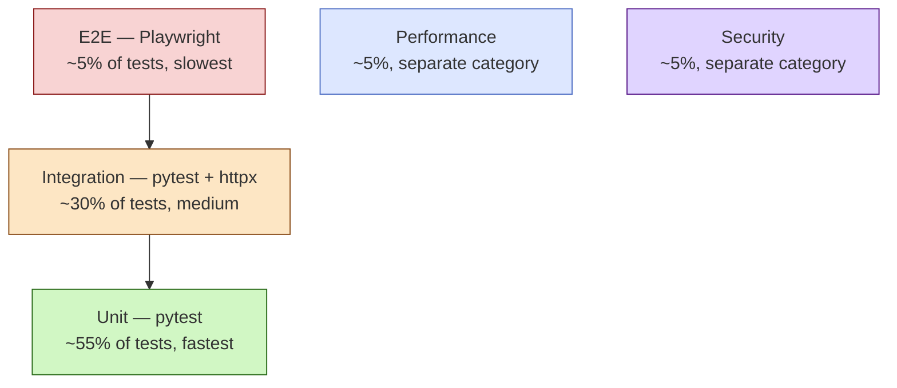

# Testing

FARA uses **five distinct levels of testing**, each responsible for a different aspect of quality. This separation isn't accidental — each level solves a problem that others can't solve well or at all.

## Five types of tests

<div class="grid cards" markdown>

-   :material-vector-line:{ .lg .middle } **Unit tests (Python)**

    ---

    Isolated checks of individual functions and classes — no DB, no network. The fastest. Runs in seconds.

    [:octicons-arrow-right-24: Details](unit.md)

-   :material-database-sync:{ .lg .middle } **Integration tests (Python)**

    ---

    Verify how modules interact with real PostgreSQL and FastAPI TestClient. Cover CRUD, permissions, business logic.

    [:octicons-arrow-right-24: Details](integration.md)

-   :material-monitor-cellphone:{ .lg .middle } **E2E (Playwright)**

    ---

    Browser tests of the UI: Chromium runs real user scenarios — login, lead creation, sending a message.

    [:octicons-arrow-right-24: Details](e2e.md)

-   :material-speedometer:{ .lg .middle } **Performance**

    ---

    Measure ORM, API, search, serialization speed under load. Benchmarks and load testing.

    [:octicons-arrow-right-24: Details](performance.md)

-   :material-shield-lock:{ .lg .middle } **Security**

    ---

    Verify ACL, Rules, permission bypass, injections, authentication. That one user can't see another's data.

    [:octicons-arrow-right-24: Details](security.md)

</div>

## Why the separation

This isn't just different folders and tools — each level has **its own goal and trade-offs**.

### Test pyramid



The higher the level — the more expensive tests are to maintain and the slower they run. So **the majority** should be unit tests, **the minority** — e2e. Not the other way around.

### What each type catches

| Type | Catches | Doesn't catch |
|------|---------|---------------|
| **Unit** | Logic inside a function — math, validation, parsing, edge cases | Whether modules actually work together |
| **Integration** | DB correctness, JSON serialization, ORM-level ACL, call chains | UI regressions, autoplay-policy, real clicks |
| **E2E** | That a user can actually do a task: login → create lead → assign manager | Performance leaks, race conditions in code |
| **Performance** | Speed regressions — was 50ms, now 300ms, search 5x slower | Data correctness |
| **Security** | Whether user A can read user B's data, rate-limit bypass, input validation | Business bugs |

### When to write each

- **Changed a parser/formatter/mapper** → unit test for new cases.
- **Added a new endpoint** → integration test for CRUD + ACL.
- **New UI page** → e2e for the key user path.
- **Rewrote a hot method (search, render, etc.)** → performance test with measurement.
- **Added a role / new permission** → security test for role isolation.

You don't need to cover each change with all five levels. Each changed piece of code requires **at least one** level — the one where it would regress.

## Running all tests

```bash
# Python unit + integration
pytest tests/unit tests/integration -v

# Performance — separate command, slow
pytest tests/performance -v -m performance

# Security
pytest tests/security -v -m security

# E2E — separate process
cd e2e && npx playwright test
```

## Folder structure

```
tests/
├── conftest.py              ← shared fixtures (db_pool, env, client)
├── unit/                    ← fast, isolated tests
├── integration/             ← with real DB
├── performance/
└── security/

e2e/                         ← Playwright (separate project)
├── playwright.config.ts
├── tests/
└── package.json
```

## See also

- [Unit tests](unit.md)
- [Integration tests](integration.md)
- [E2E with Playwright](e2e.md)
- [Performance tests](performance.md)
- [Security tests](security.md)
