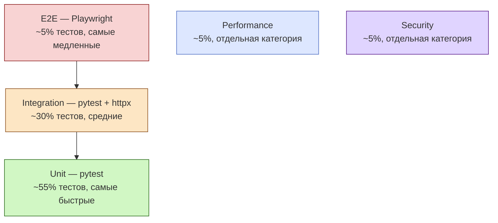

# Тестирование

В FARA используется **пять разных уровней тестирования**, каждый отвечает за свой аспект качества. Это разделение не случайно — каждый уровень решает задачу, которую другие уровни решить не могут или решают плохо.

## Пять видов тестов в FARA

<div class="grid cards" markdown>

-   :material-vector-line:{ .lg .middle } **Юнит-тесты (Python)**

    ---

    Изолированная проверка отдельных функций и классов без БД и сети. Самые быстрые. Запускаются за секунды.

    [:octicons-arrow-right-24: Подробнее](unit.md)

-   :material-database-sync:{ .lg .middle } **Интеграционные (Python)**

    ---

    Проверка взаимодействия модулей с реальной PostgreSQL и FastAPI TestClient. Покрывают CRUD, права, бизнес-логику.

    [:octicons-arrow-right-24: Подробнее](integration.md)

-   :material-monitor-cellphone:{ .lg .middle } **E2E (Playwright)**

    ---

    Браузерные тесты UI: Chromium запускает реальные пользовательские сценарии — логин, создание лида, отправка сообщения.

    [:octicons-arrow-right-24: Подробнее](e2e.md)

-   :material-speedometer:{ .lg .middle } **Производительность**

    ---

    Замеры скорости ORM, API, search, сериализации под нагрузкой. Бенчмарки и нагрузочное тестирование.

    [:octicons-arrow-right-24: Подробнее](performance.md)

-   :material-shield-lock:{ .lg .middle } **Безопасность**

    ---

    Проверка ACL, Rules, обхода прав, инъекций, аутентификации. Что один пользователь не должен видеть данные другого.

    [:octicons-arrow-right-24: Подробнее](security.md)

</div>

## Зачем нужно разделение

Это не просто разные папки и инструменты — у каждого уровня **своя цель и свои компромиссы**.

### Пирамида тестов



Чем выше уровень — тем дороже тесты в обслуживании и тем медленнее они идут. Поэтому **большая часть** должна быть unit-тестами, **меньшая** — e2e. Не наоборот.

### Что какой тип ловит

| Тип | Ловит | Не ловит |
|-----|-------|----------|
| **Unit** | Логику внутри функции — арифметика, валидация, парсинг, граничные случаи | Что в реальности модули вместе работают |
| **Integration** | Корректность работы с БД, сериализацию JSON, ACL на уровне ORM, цепочки вызовов | Регрессии в браузерном UI, autoplay-policy, реальные клики |
| **E2E** | Что пользователь реально может сделать задачу: логин → создать лид → присвоить менеджера | Утечки производительности, race conditions в коде |
| **Performance** | Регрессии скорости — было 50ms, стало 300ms, search замедлился в 5 раз | Корректность данных |
| **Security** | Может ли user A прочитать данные user B, обходятся ли rate-limits, validate input | Бизнес-баги |

### Когда какой писать

- **Изменил функцию-парсер / форматтер / маппер** → unit-тест на новые кейсы.
- **Добавил новый endpoint** → integration-тест на CRUD + ACL.
- **Сделал новую страницу UI** → e2e на ключевой пользовательский путь.
- **Переписал хот-метод (search, render, etc.)** → performance-тест с замером.
- **Добавил роль / новое право** → security-тест на изоляцию между ролями.

Не нужно покрывать каждое изменение всеми пятью уровнями. Каждый изменённый код требует **минимум один** уровень — и именно тот, на котором он стал бы регрессировать.

## Запуск всех тестов

```bash
# Python unit + integration
pytest tests/unit tests/integration -v

# Performance — отдельной командой, медленные
pytest tests/performance -v -m performance

# Security
pytest tests/security -v -m security

# E2E — отдельным процессом
cd e2e && npx playwright test
```

## Структура папок

```
tests/
├── conftest.py              ← общие fixtures (db_pool, env, client)
├── unit/                    ← быстрые тесты в изоляции
│   ├── parsers/
│   ├── validators/
│   └── helpers/
├── integration/             ← с реальной БД
│   ├── messages/
│   ├── chats/
│   └── security/
├── performance/
│   └── test_orm_performance.py
└── security/
    ├── test_acl_isolation.py
    └── test_rules_filtering.py

e2e/                         ← Playwright (отдельный проект)
├── playwright.config.ts
├── tests/
│   ├── auth.spec.ts
│   └── leads-crud.spec.ts
└── package.json
```

## CI / pipeline

В CI обычно гоняются по очереди:

1. **Lint + types** — секунды.
2. **Unit + integration** — 1-3 минуты.
3. **E2E smoke** (только критичные сценарии) — 5-10 минут.
4. **Performance baseline** — раз в день (ночной prol).
5. **Security** — на каждый PR, обязательно.

E2E полные часто запускают только перед релизом, не на каждый PR.

## См. также

- [Юнит-тесты](unit.md)
- [Интеграционные тесты](integration.md)
- [E2E тесты с Playwright](e2e.md)
- [Performance-тесты](performance.md)
- [Security-тесты](security.md)
