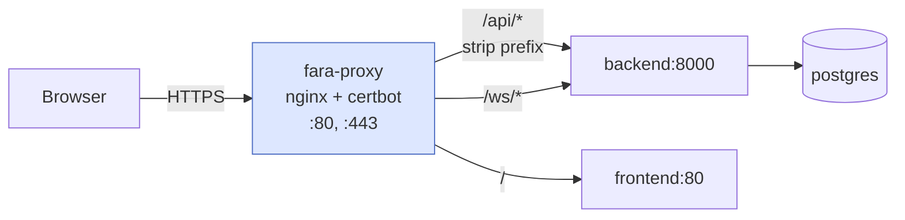

# Деплой и proxy

Production-деплой FARA через Docker Compose: основной стек (backend, frontend, postgres, cron) + отдельный `nginx-proxy` стек для HTTPS, Let's Encrypt и WebSocket. Прокси живёт в собственном compose-файле и подключается к сети основного стека через external network — это даёт независимый рестарт прокси без даунтайма приложения.

## Структура

```
/opt/faracrm/
├── docker-compose.yml           ← основной стек
├── .env
├── deploy/
│   └── proxy/
│       ├── docker-compose.yml   ← прокси-стек
│       ├── init-letsencrypt.sh  ← bootstrap SSL
│       ├── nginx/
│       │   ├── nginx.conf
│       │   └── templates/
│       │       └── fara.conf.template
│       └── certbot/             ← хранилище сертификатов
└── ...
```

Два compose-файла соединены **внешней docker-сетью** `faracrm_default`:

```yaml title="deploy/proxy/docker-compose.yml"
services:
  fara-proxy:
    networks:
      - faracrm_default

networks:
  faracrm_default:
    external: true
```

Когда основной стек поднимается — сеть создаётся автоматически. Прокси к ней просто подключается. При `docker compose down` основного стека сеть остаётся, потому что прокси держит её занятой.

## Архитектура запросов



| Префикс | Куда | Зачем strip prefix |
|---------|------|---------------------|
| `/api/*` | `backend:8000` (без `/api`) | FastAPI-роутеры объявлены без `/api`, оставлять префикс — ломать роутинг |
| `/ws/*` | `backend:8000` (с `/ws`) | Backend сам ожидает `/ws/chat` |
| `/` | `frontend:80` | SPA, отдаёт index.html |

## init-letsencrypt.sh — bootstrap SSL

При первом запуске нужен «куриный-яичный» обходной манёвр: nginx требует SSL-сертификат для запуска, а certbot требует работающего nginx для получения сертификата. Скрипт делает три шага:

1. Создаёт **dummy-сертификат** (самоподписанный) под нужный домен.
2. Запускает nginx с этим dummy.
3. Снимает dummy и запрашивает реальный сертификат у Let's Encrypt через HTTP-01 challenge.

```bash
cd /opt/faracrm/deploy/proxy
./init-letsencrypt.sh
```

При повторных запусках спрашивает: «Existing data found. Continue and replace existing certificate? (y/N)». Обычно нужно ответить **N** или ввести `1` (Keep cert) — иначе можно нарваться на rate limit Let's Encrypt (50 сертификатов на домен в неделю).

## Punycode для кириллических доменов

FARA может использовать puny домены `мой-домен.рф`. В nginx нельзя писать кириллицу напрямую — нужно сконвертировать в **punycode**:

```python
>>> "мой-домен.рф".encode("idna").decode()
'xn----htbdnodicd.xn--p1ai'
```

В `.env`:

```bash
DOMAIN=xn----htbdnodicd.xn--p1ai'
EMAIL=admin@example.com
```

В nginx-конфиге используется `${DOMAIN}` — envsubst подставляет значение при старте контейнера.

## nginx-конфигурация — нюансы

### Resolver обязателен

Если в `proxy_pass` использовать **переменную** (а это нужно для разных upstream):

```nginx
set $backend_upstream "backend:8000";
proxy_pass http://$backend_upstream/$1$is_args$args;
```

Без `resolver` директивы это даёт ошибку `no resolver defined`. Решение — указать Docker DNS:

```nginx
resolver 127.0.0.11 ipv6=off valid=30s;
```

Это встроенный DNS Docker для имён сервисов внутри сети.

### WebSocket location

WebSocket нельзя пускать через тот же location, что HTTP — нужны специфические заголовки:

```nginx
location ~ ^/ws(/|$) {
    set $backend_ws_upstream "backend:8000";
    proxy_pass http://$backend_ws_upstream;

    proxy_http_version 1.1;
    proxy_set_header Upgrade           $http_upgrade;
    proxy_set_header Connection        $connection_upgrade;

    proxy_read_timeout 3600s;
    proxy_send_timeout 3600s;
}
```

Длинный таймаут необходим — WebSocket долгоживущий, общий 300s сразу будет рвать idle-соединения.

### CSP

```nginx
add_header Content-Security-Policy "default-src 'self'; connect-src 'self' wss://$host; ..." always;
```

`wss://$host` нужен — без этого браузер не пустит WebSocket-соединение.

## Пересоздание с нуля

Если нужно полностью обнулить БД (например, при отладке):

```bash
cd /opt/faracrm

# 1. Опустить только сервисы FARA, прокси не трогаем
docker compose down

# 2. Снести volumes — БД и filestore исчезнут
docker volume rm faracrm_pgdata faracrm_filestore_docker

# 3. Пересобрать (если меняли код)
docker compose build --no-cache

# 4. Поднять
docker compose up -d
docker compose logs backend --tail 80 -f
```

Прокси сам подцепится — после `docker compose up -d` свежие контейнеры backend/frontend подключатся к сети `faracrm_default`, прокси их увидит по DNS.

Проверка:

```bash
docker exec fara-proxy ping -c 2 backend
docker exec fara-proxy ping -c 2 frontend
```

## Обновление кода

```bash
cd /opt/faracrm

# Применить изменения (распаковав очередной zip-патч)
unzip -o ~/some_patch.zip
cp -r some_patch/. ./
rm -rf some_patch

# Пересобрать только нужный сервис
docker compose build backend  # или frontend

# Поднять
docker compose up -d backend
docker compose logs backend --tail 50 -f
```

Frontend Vite билдится в production-режиме внутри Docker-образа на этапе сборки — `npm run build` уже зашит в Dockerfile. После rebuilt'а статика подменяется автоматически.

## HSTS

В nginx-конфиге HSTS закомментирован для безопасной отладки в первые недели:

```nginx
# add_header Strict-Transport-Security "max-age=31536000; includeSubDomains" always;
```

Раскомментировать через 1-2 недели стабильной работы HTTPS, когда уверены, что не нужно откатываться на HTTP.

## Что мониторить

| Что | Где смотреть |
|-----|-------------|
| Логи backend | `docker compose logs backend -f` |
| Логи nginx | `docker logs fara-proxy -f` |
| Срок сертификата | `docker exec fara-proxy ls -la /etc/letsencrypt/live/<domain>/` |
| Активные WS | `docker exec backend python -c "from backend... import ChatConnectionManager; ..."` |
| PG соединения | `docker exec postgres psql -U openpg -c "SELECT count(*) FROM pg_stat_activity"` |

Certbot обновляет сертификаты автоматически (cron внутри certbot-контейнера, `--quiet`). Если что-то ломается — запустить вручную:

```bash
docker compose -f deploy/proxy/docker-compose.yml exec certbot certbot renew --dry-run
```
