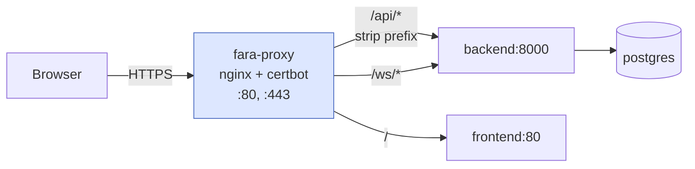

# Деплой и proxy

Production-деплой FARA через Docker Compose: основной стек (backend, frontend, postgres, cron) + отдельный `nginx-proxy` стек для HTTPS, Let's Encrypt и WebSocket. Прокси живёт в собственном compose-файле и подключается к сети основного стека через external network — это даёт независимый рестарт прокси без даунтайма приложения.

## Быстрый старт <span class="tag tag-new">проще всего</span>

Если нужен **классический деплой** без вникания в детали — заполни `.env` и запусти `deploy.sh`. Скрипт идемпотентен (можно перезапускать сколько угодно — лишнего не сделает) и сам разберётся, что нужно.

```bash title="на чистом сервере"
# 1. Клонируем
git clone https://github.com/shurshilov/faracrm.git /opt/faracrm
cd /opt/faracrm

# 2. Настраиваем окружение основного стека
cp .env.sample .env
nano .env       # DOMAIN, POSTGRES_PASSWORD, SECRET_KEY

# 3. Поднимаем основной стек (backend, frontend, postgres, cron)
docker compose up -d

# 4. Настраиваем окружение proxy-стека
cd deploy/proxy
cp .env.example .env
nano .env       # DOMAIN, EMAIL, FARA_NETWORK

# 5. Деплой proxy: SSL-сертификат + nginx-конфиг
chmod +x deploy.sh
./deploy.sh
```

После этого FARA доступна на твоём домене по HTTPS.

Что делает `deploy.sh`:

1. Проверяет, что установлен Docker и заданы все нужные переменные в `.env`.
2. Проверяет, что docker-сеть основного стека (`FARA_NETWORK`) существует.
3. Поднимает nginx в bootstrap-режиме (только HTTP) — чтобы certbot мог пройти ACME-challenge.
4. Запрашивает SSL-сертификат у Let's Encrypt (если ещё не выпущен).
5. Рендерит финальный nginx-конфиг из шаблона `fara.conf.template` через `envsubst`.
6. Reload nginx и поднимает certbot для авто-renewal.

При повторном запуске сертификат не перезапрашивается — обновляется только nginx-конфиг. Это безопасно после правок шаблона или `.env`.

!!! info "Если хочешь разобраться вручную"
    Дальше идёт детальное описание: как устроены compose-файлы, что и почему делает nginx, как пересоздавать БД, как обновлять код. Это нужно если хочешь нестандартный сетап (отдельный CDN, кластер, кастомные сертификаты).

## Структура

```
/opt/faracrm/
├── docker-compose.yml           ← основной стек
├── .env
├── deploy/
│   └── proxy/
│       ├── docker-compose.yml   ← прокси-стек
│       ├── deploy.sh            ← главный скрипт деплоя
│       ├── nginx/
│       │   ├── nginx.conf
│       │   └── templates/
│       │       └── fara.conf.template
│       └── certbot/             ← хранилище сертификатов
└── ...
```

Два compose-файла соединены **внешней docker-сетью** `faracrm_default`:

```yaml title="deploy/proxy/docker-compose.yml"
services:
  fara-proxy:
    networks:
      - faracrm_default

networks:
  faracrm_default:
    external: true
```

Когда основной стек поднимается — сеть создаётся автоматически. Прокси к ней просто подключается. При `docker compose down` основного стека сеть остаётся, потому что прокси держит её занятой.

## Архитектура запросов



| Префикс | Куда | Зачем strip prefix |
|---------|------|---------------------|
| `/api/*` | `backend:8000` (без `/api`) | FastAPI-роутеры объявлены без `/api`, оставлять префикс — ломать роутинг |
| `/ws/*` | `backend:8000` (с `/ws`) | Backend сам ожидает `/ws/chat` |
| `/` | `frontend:80` | SPA, отдаёт index.html |

## deploy.sh — детально

При первом запуске нужно решить «куриный-яичный» парадокс: nginx требует SSL-сертификат для запуска, а certbot требует работающего nginx для прохождения ACME challenge. `deploy.sh` обходит это так:

1. Создаёт **временный bootstrap-конфиг** для nginx — только HTTP-listener на 80 порту, плюс path `/.well-known/acme-challenge/` для certbot. Никакого SSL.
2. Поднимает nginx с этим конфигом — он уже отвечает на запросы по HTTP.
3. Запускает certbot через webroot — он кладёт challenge-файл в `/var/www/certbot/.well-known/...`, Let's Encrypt стучится по HTTP, файл найден, сертификат выпущен.
4. Рендерит **финальный nginx-конфиг** из шаблона `fara.conf.template` через `envsubst` (подставляются переменные из `.env`).
5. `nginx -s reload` — nginx подхватывает новый конфиг с SSL.
6. `docker compose up -d` — поднимает certbot-контейнер, который в фоне обновляет сертификат каждые 12 часов.

```bash
cd /opt/faracrm/deploy/proxy
./deploy.sh
```

### Идемпотентность

При повторном запуске `deploy.sh`:

- **Сертификат не перезапрашивается** — скрипт видит существующий `./certbot/conf/live/$DOMAIN/fullchain.pem` и пропускает шаг.
- **Конфиг nginx перерендеривается заново** — это безопасно после правок шаблона или `.env`.
- **`nginx -s reload`** применяет новый конфиг без даунтайма.

Это значит, что после изменения `fara.conf.template` (например, добавил новый location, поменял CSP) — достаточно `./deploy.sh`, и через 1-2 секунды правки уже в проде.

### Принудительный перевыпуск сертификата

Если нужно перевыпустить сертификат (сменился домен, истёк, что-то сломалось):

```bash
rm -rf ./certbot/conf/live/$DOMAIN
./deploy.sh
```

!!! warning "Rate limit Let's Encrypt"
    Let's Encrypt разрешает 50 сертификатов на домен в неделю. Если экспериментируешь с настройкой — выставляй `STAGING=1` в `.env`. Тогда сертификат выпустится из staging-CA, лимит у которого больше, но в браузере он будет невалидным.

### Кириллический домен

Скрипт сам проверит `DOMAIN` на не-ASCII символы и подскажет, как сконвертировать в punycode. Например, для домена `моя-срм.рф`:

```bash
python3 -c "print('моя-срм.рф'.encode('idna').decode())"
# → xn----wtbbglf0h.xn--p1ai
```

В `.env` нужно положить уже punycode-версию.

## Punycode для кириллических доменов

Если используешь кириллический домен (например, `моя-срм.рф`) — в nginx нельзя писать кириллицу напрямую, нужно сконвертировать в **punycode**:

```python
>>> "моя-срм.рф".encode("idna").decode()
'xn----wtbbglf0h.xn--p1ai'
```

В `.env`:

```bash
DOMAIN=xn----wtbbglf0h.xn--p1ai
EMAIL=admin@example.com
```

В nginx-конфиге используется `${DOMAIN}` — envsubst подставляет значение при старте контейнера.

## nginx-конфигурация — нюансы

### Resolver обязателен

Если в `proxy_pass` использовать **переменную** (а это нужно для разных upstream):

```nginx
set $backend_upstream "backend:8000";
proxy_pass http://$backend_upstream/$1$is_args$args;
```

Без `resolver` директивы это даёт ошибку `no resolver defined`. Решение — указать Docker DNS:

```nginx
resolver 127.0.0.11 ipv6=off valid=30s;
```

Это встроенный DNS Docker для имён сервисов внутри сети.

### WebSocket location

WebSocket нельзя пускать через тот же location, что HTTP — нужны специфические заголовки:

```nginx
location ~ ^/ws(/|$) {
    set $backend_ws_upstream "backend:8000";
    proxy_pass http://$backend_ws_upstream;

    proxy_http_version 1.1;
    proxy_set_header Upgrade           $http_upgrade;
    proxy_set_header Connection        $connection_upgrade;

    proxy_read_timeout 3600s;
    proxy_send_timeout 3600s;
}
```

Длинный таймаут необходим — WebSocket долгоживущий, общий 300s сразу будет рвать idle-соединения.

### CSP

```nginx
add_header Content-Security-Policy "default-src 'self'; connect-src 'self' wss://$host; ..." always;
```

`wss://$host` нужен — без этого браузер не пустит WebSocket-соединение.

## Пересоздание с нуля

Если нужно полностью обнулить БД (например, при отладке):

```bash
cd /opt/faracrm

# 1. Опустить только сервисы FARA, прокси не трогаем
docker compose down

# 2. Снести volumes — БД и filestore исчезнут
docker volume rm faracrm_pgdata faracrm_filestore_docker

# 3. Пересобрать (если меняли код)
docker compose build --no-cache

# 4. Поднять
docker compose up -d
docker compose logs backend --tail 80 -f
```

Прокси сам подцепится — после `docker compose up -d` свежие контейнеры backend/frontend подключатся к сети `faracrm_default`, прокси их увидит по DNS.

Проверка:

```bash
docker exec fara-proxy ping -c 2 backend
docker exec fara-proxy ping -c 2 frontend
```

## Обновление кода

```bash
cd /opt/faracrm
# Вариант через гит (рекомендуемый)
git pull
docker compose build
docker compose down
docker compose up
```

```bash
cd /opt/faracrm
# Вариант через zip файл
unzip -o ~/some_patch.zip
cp -r some_patch/. ./
rm -rf some_patch
docker compose build
docker compose down
docker compose up
```


Frontend Vite билдится в production-режиме внутри Docker-образа на этапе сборки — `npm run build` уже зашит в Dockerfile. После rebuilt'а статика подменяется автоматически.

## HSTS

В nginx-конфиге HSTS закомментирован для безопасной отладки в первые недели:

```nginx
# add_header Strict-Transport-Security "max-age=31536000; includeSubDomains" always;
```

Раскомментировать через 1-2 недели стабильной работы HTTPS, когда уверены, что не нужно откатываться на HTTP.

## Что мониторить

| Что | Где смотреть |
|-----|-------------|
| Логи backend | `docker compose logs backend -f` |
| Логи nginx | `docker logs fara-proxy -f` |
| Срок сертификата | `docker exec fara-proxy ls -la /etc/letsencrypt/live/<domain>/` |
| Активные WS | `docker exec backend python -c "from backend... import ChatConnectionManager; ..."` |
| PG соединения | `docker exec postgres psql -U openpg -c "SELECT count(*) FROM pg_stat_activity"` |

Certbot обновляет сертификаты автоматически (cron внутри certbot-контейнера, `--quiet`). Если что-то ломается — запустить вручную:

```bash
docker compose -f deploy/proxy/docker-compose.yml exec certbot certbot renew --dry-run
```
