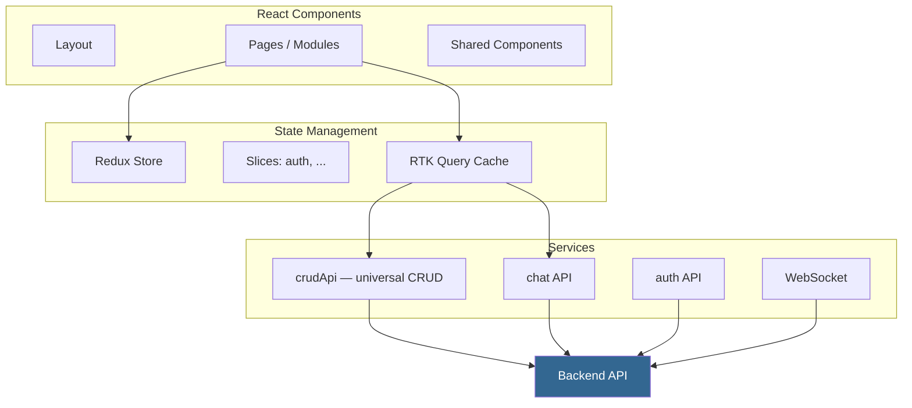

# Архитектура Frontend

## Обзор



## Модульная структура

Каждый CRM-модуль — самостоятельная папка:

```
fara_chat/
├── components/
│   ├── ChatPage.tsx          # Главная страница чата
│   ├── ChatList.tsx          # Список чатов
│   ├── MessageList.tsx       # Список сообщений
│   └── MessageInput.tsx      # Ввод сообщения
├── hooks/
│   ├── useChat.ts            # Хук для чат-логики
│   └── useWebSocket.ts       # WebSocket подключение
├── context/
│   └── ChatContext.tsx        # React Context для чата
└── locales/
    ├── ru.json
    └── en.json
```

## Routing

```typescript title="frontend/src/route/Routers.tsx"
const routes = [
    { path: "/chats",     component: ChatPage },
    { path: "/leads",     component: LeadsPage },
    { path: "/sales",     component: SalesPage },
    { path: "/partners",  component: PartnersPage },
    { path: "/products",  component: ProductsPage },
    { path: "/tasks",     component: TasksPage },
    { path: "/users",     component: UsersPage },
    { path: "/settings",  component: SettingsPage },
];
```

## Мultilingual (i18n)

Каждый модуль имеет свои переводы в `locales/`:

```json title="fara_chat/locales/ru.json"
{
    "chat": {
        "title": "Чаты",
        "newChat": "Новый чат",
        "typeMessage": "Введите сообщение...",
        "pinned": "Закреплённые"
    }
}
```

```typescript
import { useTranslation } from 'react-i18next';

function ChatHeader() {
    const { t } = useTranslation();
    return <h1>{t('chat.title')}</h1>;
}
```
