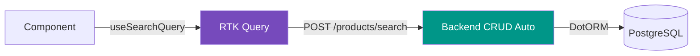

# CRUD API Service

Универсальный RTK Query клиент для работы с любой DotORM-моделью.

## Концепция

Backend автоматически генерирует CRUD-эндпоинты для каждой модели. Frontend использует **один** `crudApi` для работы со всеми моделями — имя модели передаётся как параметр.



## Типы

```typescript title="frontend/src/services/api/crudTypes.ts"
// Параметры поиска
interface GetListParams {
    model: string;                         // имя модели ("products", "users")
    filter?: Array<[string, string, any]>; // [field, operator, value]
    fields?: string[];
    order?: string;
    sort?: 'asc' | 'desc';
    start?: number;
    end?: number;
    limit?: number;
}

// Результат поиска
interface GetListResult<T = FaraRecord> {
    data: T[];
    total: number;
}

// Параметры чтения
interface ReadParams {
    model: string;
    id: number;
    fields?: string[];
}

// Параметры создания
interface CreateParams {
    model: string;
    data: Record<string, any>;
}

// Параметры редактирования
interface EditParams {
    model: string;
    id: number;
    data: Record<string, any>;
}

// Параметры удаления
interface DeleteListParams {
    model: string;
    ids: number[];
}
```

## Хуки

RTK Query автоматически генерирует хуки из endpoints:

### useSearchQuery

```tsx
import { crudApi } from '@services/api/crudApi';

function PartnerList() {
    const { data, isLoading, error, refetch } = crudApi.useSearchQuery({
        model: 'partners',
        filter: [
            ['active', '=', true],
            ['name', 'ilike', '%john%'],
        ],
        fields: ['id', 'name', 'email', 'phone'],
        order: 'name',
        sort: 'asc',
        limit: 50,
    });

    if (isLoading) return <Loader />;
    if (error) return <Alert color="red">Ошибка загрузки</Alert>;

    return (
        <DataTable
            records={data?.data ?? []}
            columns={[
                { accessor: 'name' },
                { accessor: 'email' },
                { accessor: 'phone' },
            ]}
        />
    );
}
```

### useReadQuery

```tsx
function ProductDetail({ id }: { id: number }) {
    const { data } = crudApi.useReadQuery({
        model: 'products',
        id,
        fields: ['id', 'name', 'price', 'description', 'category_id'],
    });

    return <ProductForm initialValues={data?.data} />;
}
```

### useCreateMutation

```tsx
function CreatePartnerForm() {
    const [create, { isLoading }] = crudApi.useCreateMutation();

    const handleSubmit = async (values: PartnerForm) => {
        const result = await create({
            model: 'partners',
            data: values,
        }).unwrap();

        notifications.show({
            title: 'Создано',
            message: `Партнёр #${result.data.id} создан`,
        });
    };

    return <Form onSubmit={handleSubmit} loading={isLoading} />;
}
```

### useEditMutation

```tsx
function EditProductForm({ id }: { id: number }) {
    const [edit, { isLoading }] = crudApi.useEditMutation();

    const handleSubmit = async (values: Partial<Product>) => {
        await edit({
            model: 'products',
            id,
            data: values,
        }).unwrap();
    };

    return <Form onSubmit={handleSubmit} loading={isLoading} />;
}
```

### useDeleteListMutation

```tsx
function DeleteButton({ ids }: { ids: number[] }) {
    const [deleteList] = crudApi.useDeleteListMutation();

    return (
        <Button
            color="red"
            onClick={() => deleteList({ model: 'products', ids })}
        >
            Удалить ({ids.length})
        </Button>
    );
}
```

## Кэширование и инвалидация

RTK Query автоматически кэширует ответы и инвалидирует при мутациях:

```typescript
// crudApi endpoints
search: build.query({
    // ...
    providesTags: (result, error, arg) =>
        result
            ? [{ type: arg.model, id: 'LIST' }]
            : [],
}),

create: build.mutation({
    // ...
    invalidatesTags: (result, error, arg) => [
        { type: arg.model, id: 'LIST' },  // (1)!
    ],
}),
```

1. После создания записи RTK Query автоматически перезапросит все `search`-запросы для этой модели.
