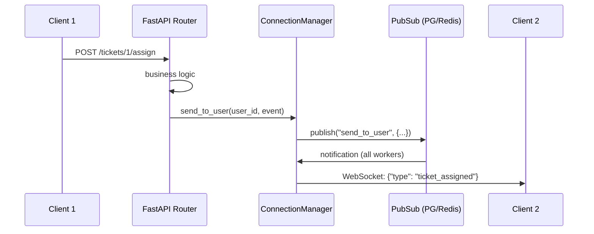

# WebSocket — добавление real-time событий

Как добавить WebSocket-уведомления в существующий модуль.

## Архитектура



## Backend — отправка события

### 1. Импорт chat_manager

```python title="backend/base/crm/tickets/routers/tickets.py"
from backend.base.crm.chat.websocket import chat_manager
```

### 2. Отправка после действия

```python
@router_private.post("/{ticket_id}/assign")
async def assign_ticket(req: Request, ticket_id: int, body: AssignBody):
    env: "Environment" = req.app.state.env

    ticket = await env.models.ticket.get(ticket_id)
    await ticket.update(env.models.ticket(
        assigned_to=body.user_id,
        status="in_progress",
    ))

    # Уведомить назначенного пользователя
    await chat_manager.send_to_user(             # (1)!
        user_id=body.user_id,
        message={
            "type": "ticket_assigned",
            "ticket_id": ticket_id,
            "title": ticket.title,
        },
    )

    return {"success": True}
```

1. `send_to_user` — отправляет событие конкретному пользователю через все его WebSocket-подключения (включая другие вкладки и worker-процессы).

### Методы отправки

| Метод | Описание |
|-------|----------|
| `send_to_chat(chat_id, message)` | Всем участникам чата |
| `send_to_user(user_id, message)` | Конкретному пользователю |

## Frontend — обработка события

```typescript title="frontend/src/fara_tickets/hooks/useTicketEvents.ts"
import { useWebSocket } from '@fara_chat/hooks/useWebSocket';
import { notifications } from '@mantine/notifications';

export function useTicketEvents() {
    const handleMessage = useCallback((data: any) => {
        switch (data.type) {
            case 'ticket_assigned':
                // Показать уведомление
                notifications.show({
                    title: 'Новый тикет',
                    message: `Вам назначен тикет: ${data.title}`,
                    color: 'blue',
                });

                // Инвалидировать кэш списка тикетов
                dispatch(
                    crudApi.util.invalidateTags([
                        { type: 'tickets', id: 'LIST' }
                    ])
                );
                break;

            case 'ticket_status_changed':
                // Обновить конкретный тикет в кэше
                dispatch(
                    crudApi.util.updateQueryData(
                        'read',
                        { model: 'tickets', id: data.ticket_id },
                        (draft) => {
                            draft.data.status = data.status;
                        }
                    )
                );
                break;
        }
    }, [dispatch]);

    useWebSocket(token, handleMessage);
}
```

## Тестирование

В тестах мокай `send_to_chat` / `send_to_user`:

```python
from unittest.mock import AsyncMock, patch

@patch(
    "backend.base.crm.chat.websocket.chat_manager.send_to_user",
    new_callable=AsyncMock,
)
async def test_assign_ticket_sends_notification(
    self, mock_ws, authenticated_client
):
    client, user_id, token = authenticated_client
    ticket_id = await self._create_ticket()

    response = await client.post(
        f"/tickets/{ticket_id}/assign",
        json={"user_id": user_id},
    )

    assert response.status_code == 200

    # Проверяем что WS-уведомление отправлено
    mock_ws.assert_called_once_with(
        user_id=user_id,
        message={
            "type": "ticket_assigned",
            "ticket_id": ticket_id,
            "title": "Test Ticket",
        },
    )
```

!!! warning "Не забудь замокать WebSocket"
    Без мока `send_to_user` / `send_to_chat` тест уйдёт в реальный PubSub и может зависнуть (если PubSub listener занял все соединения пула).
